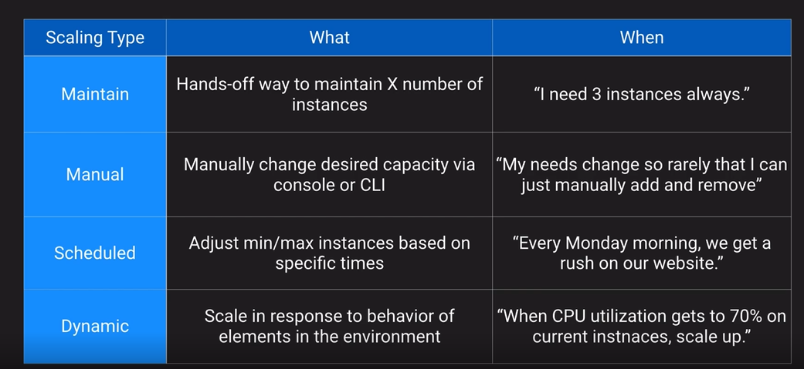

# Architecture at Scale

## Loosely Couple Architecture

- Components can work independently and require little to no knowledge of the inner workings of the other components
  - Layers of Abstraction
  - Flexibility
  - Interchangeable Components
  - Atomic Function Units
  - Scale Components Independently
- Scaling Up
  - Add more CPU or RAM to an existing instance as demand increases
  - Requieres restart to scale up or scale down
  - Limit by instance size
  - Would require
- Scale Down
  - Add more instances as demand increases
  - No down time required
  - Automatic scaling available

## Auto-Scaling

### Types of Auto-Scaling

## EC2 Auto-Scaling Groups

- Automatically provides horizontal scaling (scale-out) for your landscape
- Triggered by an event or scaling action to either launch or terminate instances
- Availability, Cost and System Metrics can all factor into scaling
- Four scaling option
  - Maintain - keep a specific or minimum or specific number of instances
  - Manual - Use maximum, minimum, or specific numbers of instances
  - Schedule - Increase or decrease instances based on schedule
  - Dynamic - Scale based on real-time metrics of the systems.

When you setting up a EC2 Auto-Scaling Group you need to set up a launch configuration

### Scaling Types

### EC2 AutoScaling Policies

## Scaling Cooldown Concept for EC2

- Configurable duration that gives your scaling a chance to “come up to speed” and absorb load.
- Default cooldown period is 300 seconds
- Automatically applies to dynamic scaling and optionally to manual scaling but not supported for schedules scaling
- Can override default cooldown via scaling-specific cool down

## Scaling based on Amazon  SQS

## AWS Application Auto Scaling

## Computer Optimizer

- Machine learning tool to give you recommendations on compute resources
- Increase cost efficiency by reconfiguring over-provisioned resources
- Improve performance by rightsizing under-provisioned resources
- Activate in one account or across your organization

### Up next [AWS Kinesis](./aws-kinesis/README.md)...

