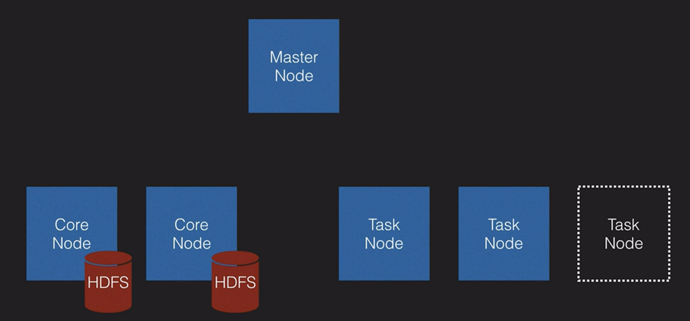
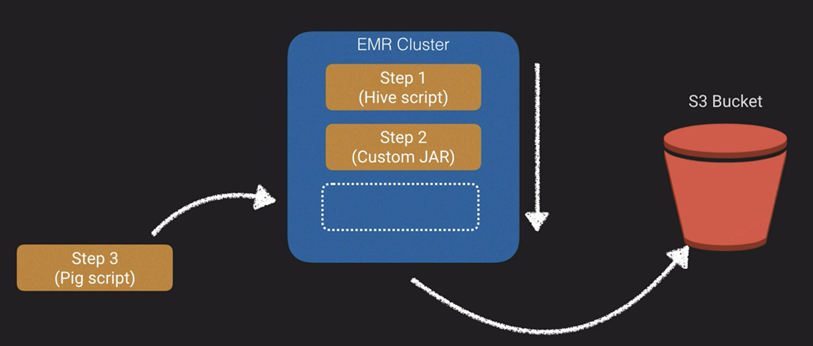

# Amazon Elastic MapReduce (EMR)

- It’s a collection of products.
- Managed Hadoop framework for processing huge amounts of data
- Supports Apache Spark, HBase, Presto and Flink
- Used for log analysis, financial analysis or extract, translate and loading (ETL) activities
- A Step in a programmatic task for performing some process on data (i.e. count words)
- A cluster is a collection of EC2 instances provisioned by EMR to run your Steps

## Components of AWS EMR

## AWS EMR Process

## What is Hadoop / EMR ?

## Hadoop Ecosystem

- Hadoop HDFS is a file system that the data gets stored in, and Hadoop MapReduce is the actual framework used to do the processing of the data.
- ZooKeeper which is involved in resource coordination.
- Oozie, which is a workflow framework
- Pig which is a scripting framework
- Hive, SQL interface into our Hadoop landscape
- Mahout, which is a machine learning component
- HBASE, columnar database for storing Hadoop data.
- Flume, useful for ingesting application and system logs.
- Scoop, facilitate the import of data into Hadoop from other databases
- Ambari, which is a management and monitoring console.

### Up next [Amazon QuickSight](../amazon-quicksight/README.md)...
