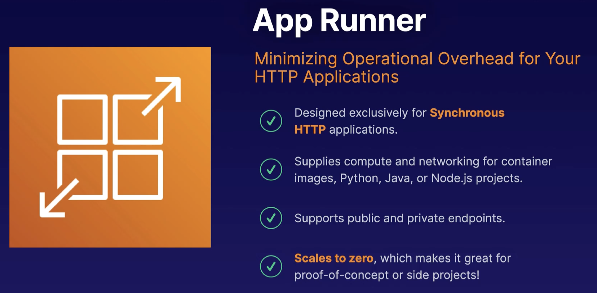

# AWS Fargate

When using **container instances**, you will have EC2 instance behind an auto scaling group. Those EC2 instances will have containerized tasks running on them. As the number of tasks increase, you will need to boot up new EC2 instances in your auto scaling group to accomodate the compute and memory needed to complete those tasks. 

When you run the containerized workloads on **Fargate**, your compute layer scales per task. This is much faster than scaling EC2 instances and reduces operational overhead by allowing AWS to handle security and patches.

### Up next [AWS Batch](../aws-batch/README.md)...
