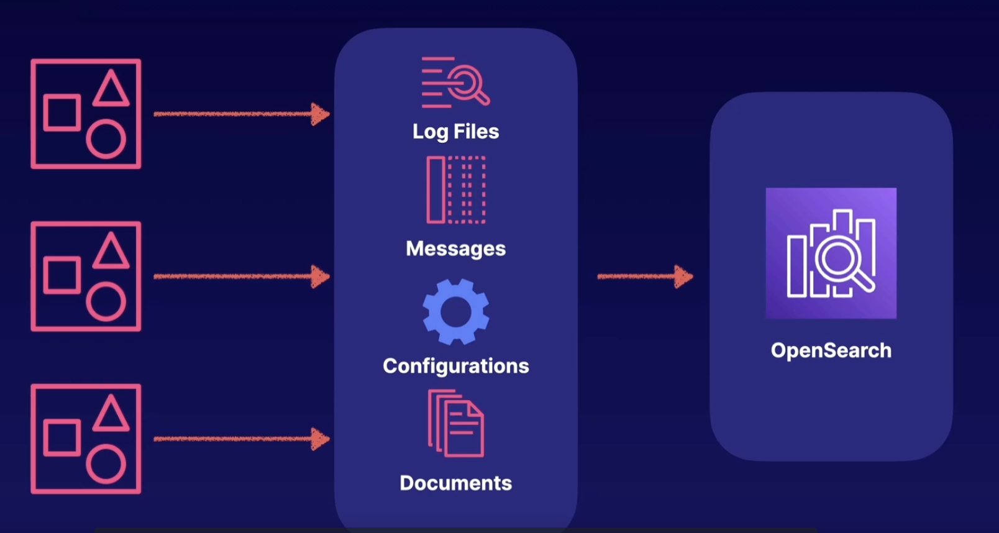

# Amazon OpenSearch

- Experience with ElasticSearch or Kibana (this is a good tool to migrate from)
- Open source search and analytics suite forked from ElasticSearch
- Provides AWS-managed OpenSearch clusters
- Create OpenSearch dashboards or use built-in Kibana
- Visualize, search, and analyze data in real time
- More advances querying and lower cost at scale compared to CloudWatch
- OpenSearch can also be used as a data source into Amazon QuickSight

### Up next [Architecture At Scale Tips](../architecture-at-scale-tips/README.md)...