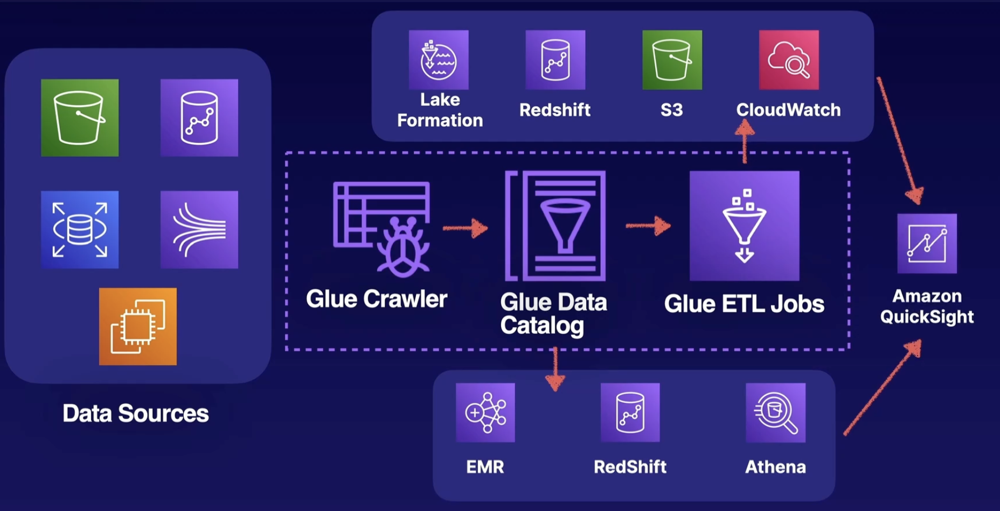

# Amazon QuickSight

- Server pay-per-user service
- Low cost compared to other BI solutions
- Uses SPICE  (in-memory cache for super fast data analytics) and AutoGraph technologies(supply a best-fit graph given a set of data).
- Access by web browser and mobile application
- Creates hybrid datasets from multiple sources
- Can leverage AWS AI/ML for natural language queries and automated insights

- Can integrate with AWS Glue

# [Amazon OpenSearch](../amazon-opensearch/README.md)...

