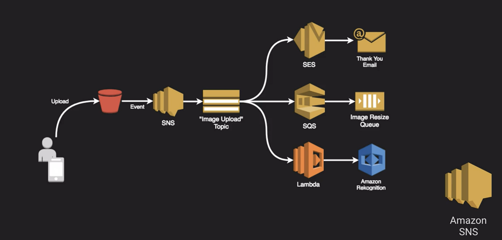

# Amazon SNS

- Enables a Publish/Subscribe design pattern
- Topic = A channel for publishing a notification
- Subscription = Configuring an endpoint to receive messages published on the topic
- Endpoints protocols include
  - HTTP(s)
  - Email
  - SMS
  - SQS
  - Amazon Device Messaging (push notifications)
  - Lambda

## Fan Out Architecture

Configure three different endpoints that can do this in parallel. It is a good way to achieve loosely coupled architecture

### [Amazon SQS](../amazon-sqs/README.md)...
