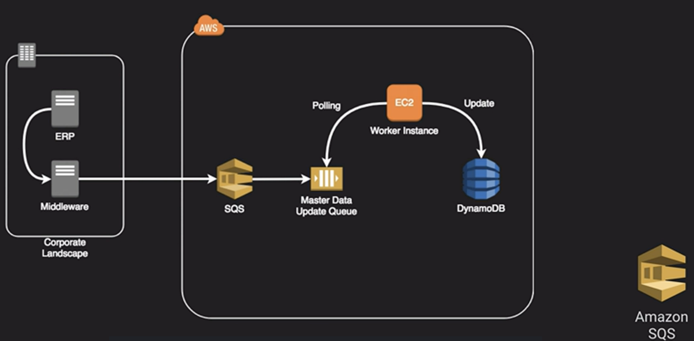

# Amazon SQS

- Reliable, high scalable, hosted message queuing service
- Available integration with KMS for encrypted messaging
- Transient storage - default 4 days, max 14 days
- Supports FIFO queue ordering
- Max size is 256KB but using a special Java SQS SDK, you can have message as large as 2GB

## Loosely Coupled Architecture

We have an ERP system that is generating updates. The middleware lands these messages into an SQS queue where they’re then picked up by an EC2 worker instance. They are then updated into DynamoDB.

Image the message traffic comes intermittently, we can scale horizontally by adding more worker instances and process through that queue faster if we need to.

## Standard Queue

No assurance the messages will leave the queue based on when arrive. There is no guarantee that we can process those messages in order.

## First in - First out Queue

Will maintain the order in which the order is receive. The big trade-off is that is that enforcing this order processing means that if a message fails or gets stuck, it’s going to hold up all the other messages behind it.  It can introduce latency or delay in clearing queues.

### [Amazon MQ](../amazon-mq/README.md)...
