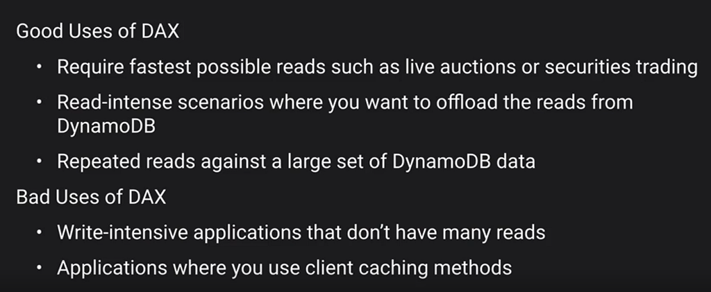

# DynamoDB Scaling

There are two ways to scale DynamoDB, either provisioning capacity or on-demand capacity.

## Provisioning Capacity

You can have two partition calculation (by size or by capacity)

For example, if we have 10 GB table and 2,000 Read Capacity Units and Write Capacity Units

AWS does allow Burst Capacity against a single partition but it is not recommended.

**DynamoDB Stores Data**

- How to land hashes on the different partitions
- The partition key gets translated into a hash value
- If we have one partition, all the data is going to land on the same partition

If we have two partition or three then it DynamoDB splits them equally

## Use Case: Getting data from sensors

1. Hot Partition or hot key issue

2. Better way to structure would be to have the partition key by sensor_id

## Key things

- Using Target Tracking method to try to stay close to target utilization
- Currently does not scale if table’s consumption drops to zero
- Also supports Global Secondary Index

On demand scaling is

- Alternative to Autoscaling
- Cost more
- Instantly allocated capacity

## DynamoDB Accelerator - in memory cache

### [CloudFront Part Two](../cloudfront-part-2/README.md)...
