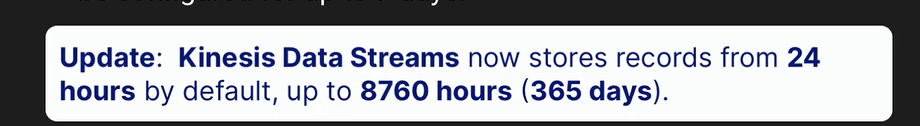
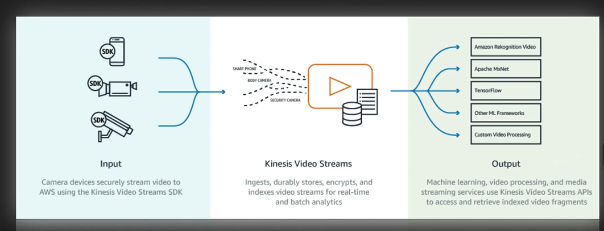
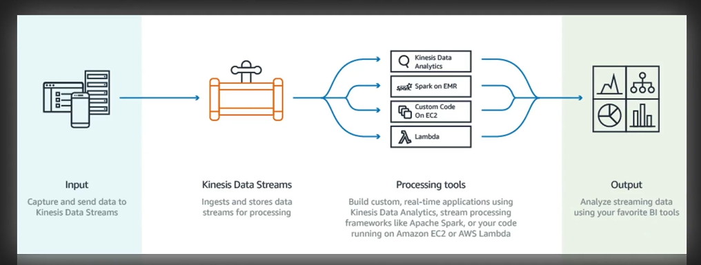
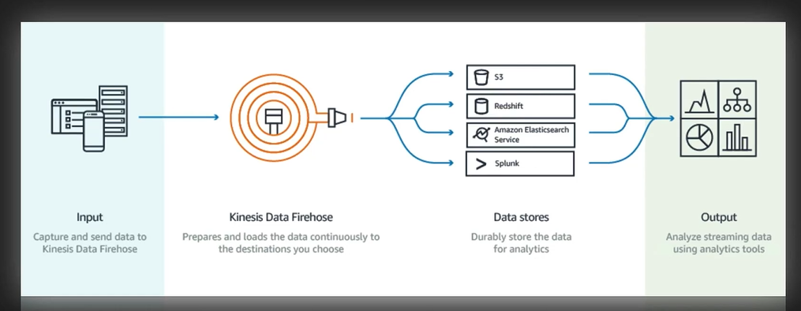
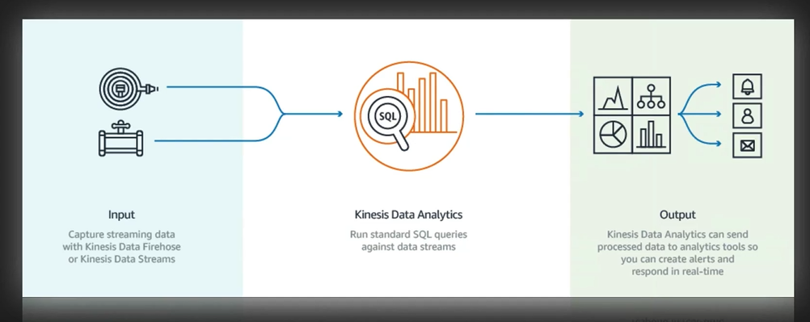
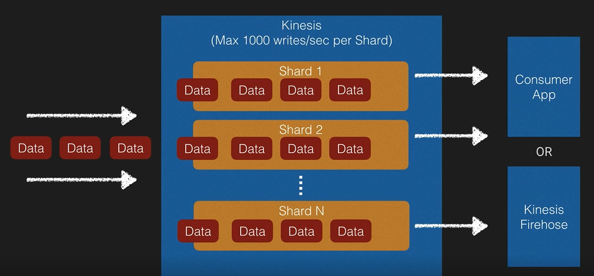
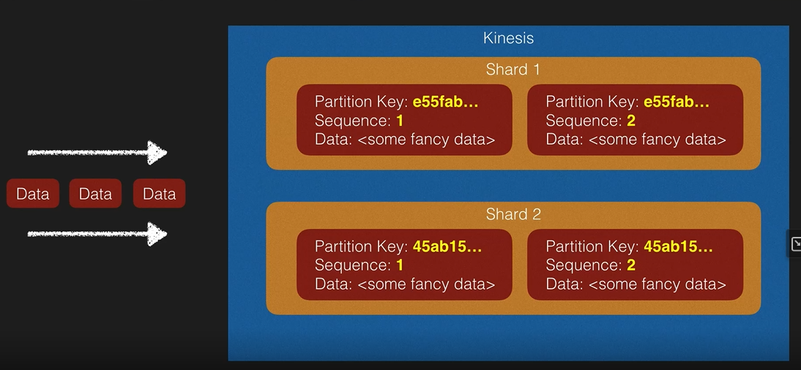
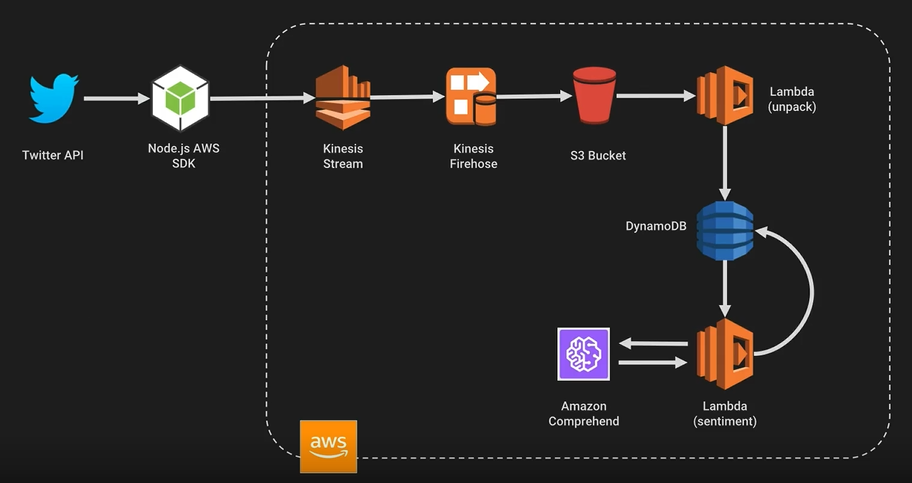

# AWS Kinesis

- Collection of services for processing streams of various data
- Data is processed in “shards” - with each shard able to ingest
- A default limit of 500 shards, can request increase to unlimited shards
- Record consist of Partition Key, Sequence Number and Data Blog (up to 1MB)
- Transient Data Store - Default retention of 24 hours, but can be configured for up to 7 days.

## AWS Kinesis Video Streams

## AWS Data Streams

## AWS Firehose

## AWS Kinesis Data Analytics

## Kinesis Data Stream Key Concepts

Each shard is a lane in the highway. The more shards you have, the more you can process data.

- Each shard is given a partition key
- Each data gets assigned a sequence number and you can use it to identify the newness

### Example of using Kinesis Stream and Firehose

### Up next [DynamoDB Scaling](../aws-dynamodb/README.md)...
