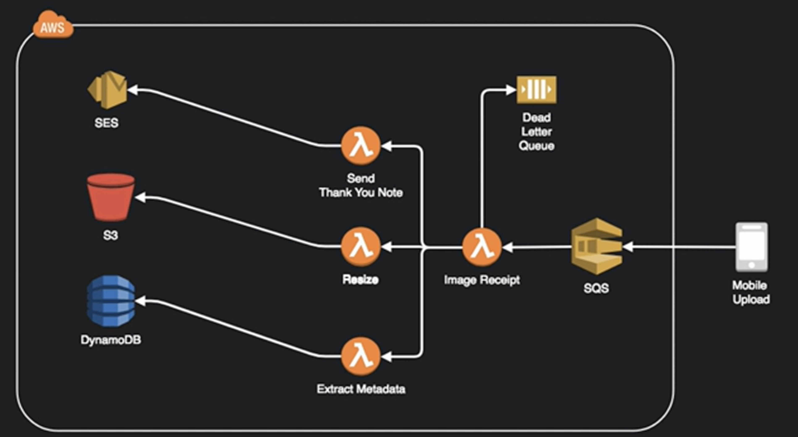
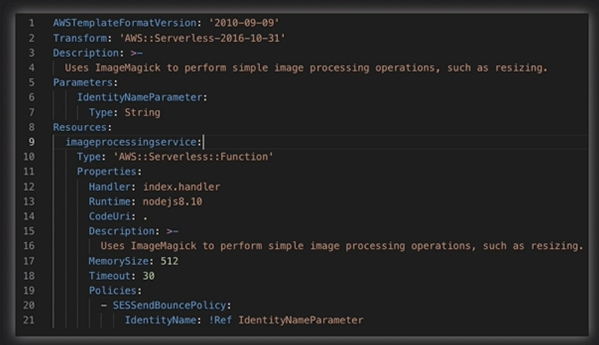

# AWS Lambda

- Allows you to run code on-demand
- Supports Node.JS, Python, Java, Go and C#
- Extremely useful option for creating serverless architectures
- Code is stateless and executed on an event basis (SNS, SQS, S3, DynamoDB Stream, etc)
- No fundamental limit to scaling a function since AWS dynamically allocated capacity in relation to events.

## Fan Out Architecture

## AWS Serverless Application Model

- Open source framework for building serverless apps on AWS
- Uses YAML as the configuration language
- Includes AWS CLI-like functions to create, deploy and update serverless apps using AWS such as Lambda, DynamoDB and API Gateway
- Enables local testing and debugging of apps using a Lambda-like emulator via Docker
- Extension of CloudFormation so you can use everything CloudFormation can provide by way of resources and functions.

## Example of a YAML Serverless Application Model

To test the application you can do `sam local start-api` and then you can deploy using `sam deploy`.

### Up next [Amazon EventBridge](../amazon-event-bridge/README.md)...
