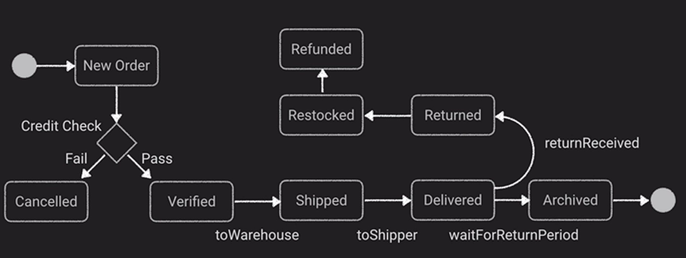
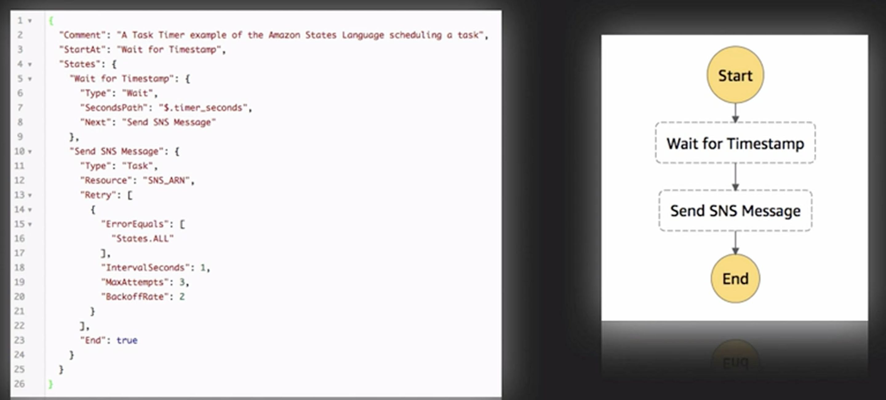
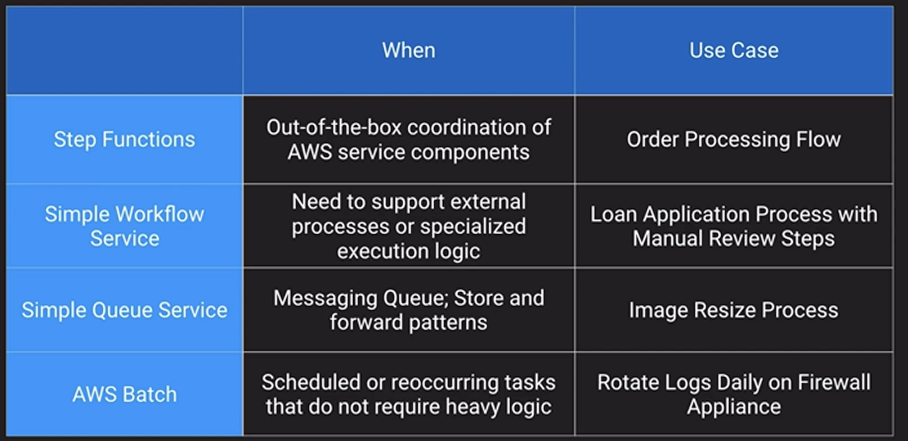

# AWS Step Functions

- Managed workflow and orchestration platform
- Define your app as a state machine
- Create tasks, sequential steps, parallel steps, branching paths or timers
- Amazon State Language declarative JSON
- Apps can interact and update the stream via Step Function API
- Visual interface describes flow and realtime status
- Detailed logs

Fine state machine - System design, an object can assume different states or statuses through a process.

## Task Timer Example

## Comparison

### [Amazon EMR](../amazon-emr/README.md)...
