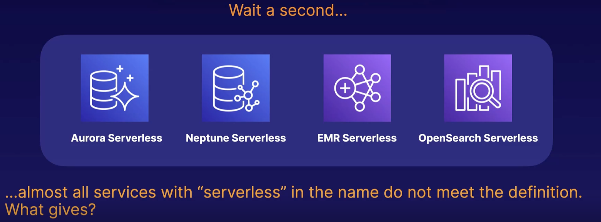
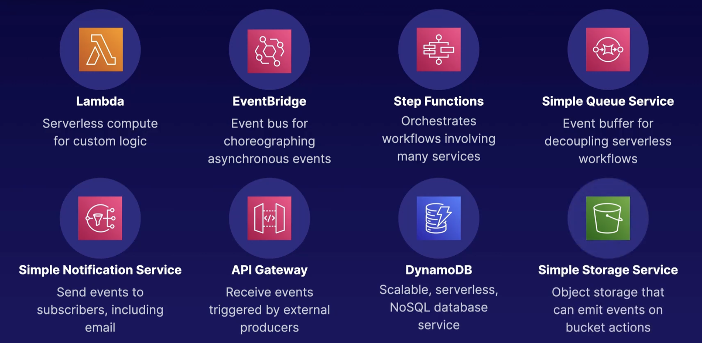
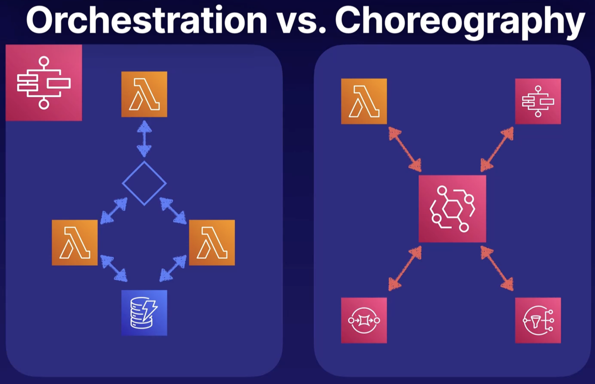
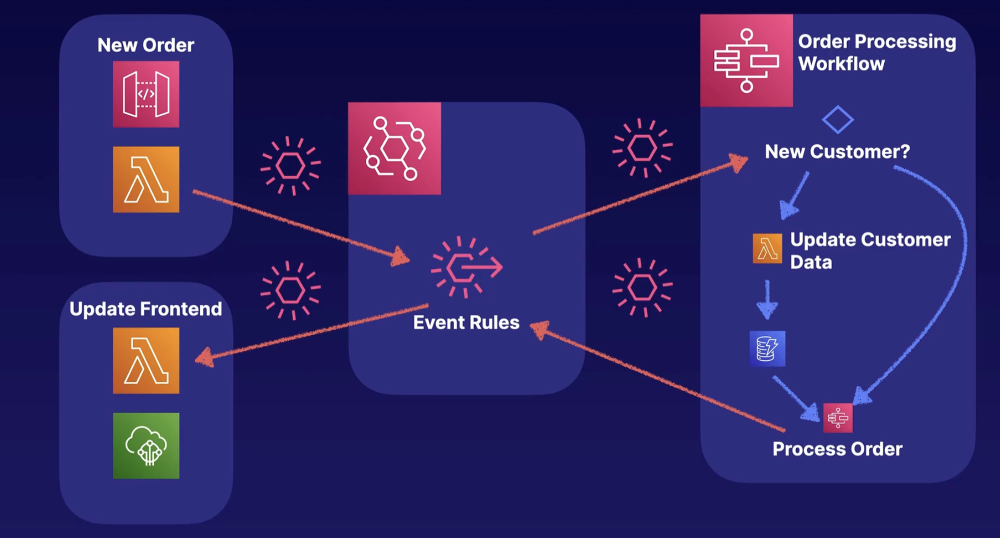

# Event Driven Architecture

- Triggering asynchronous events across your AWS Environments with events
- An event is any change in state or update signaled by an event producer
- Event routers filter and push events and their payloads to event consumers
- Event consumers use the payload to update state and make backened changes.

What is a service considered serverless?

- No server management: patches and OS updates are handled by the provider
- Flexible scaling: your application scales automatically within the bounds you define
- High availability: Availability and fault tolerant are built in by default
- Scales to zero: There is no idle capacity when services are not in use

The following product are not truly serverless, however, they are the closes to serverless

## The Main Players in Serverless

## Orchestration vs. Choreography

Orchestration involves orchestrating a workflow, and this can involve things like decision trees or retries. More highly coupled workflows and are usually orchestrated in AWS Step Functions.

Choreography involves the asynchronous coordination of many event producers and consumers. And this all happens asynchronously. Event orchestrators, such a step functions can be a part of the choreographed, serverless ecosystem.

## Real Use Case

1. Front-end application that can produce a new order. When producing a new order, it can make a call to an API Gateway, which triggers a Lambda
2. You have your central even hub, EventBridge, which will determine where the data is set once the Lambda function is triggered.
3. On the back-end, you have a workflow in Step Functions which determine whether the event comes from a new customer or an existing customer.

### Up next [Amazon SNS](../amazon-sns/README.md)
