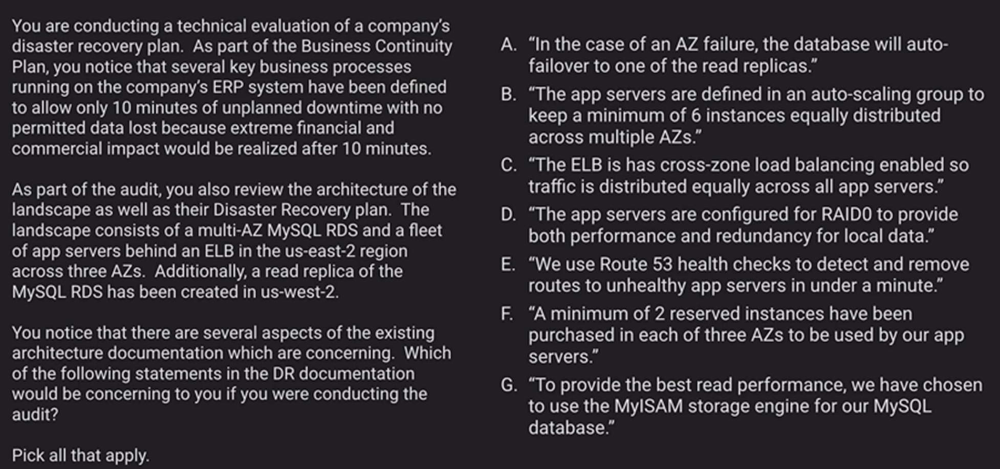

# Business Continuity Challenges

## Challenge #1

My Answer: B

RTO: times to take us to come back after a disaster

RPO: Amount of data we can afford to lose

EFS is about 15x more expensive than S3

Correct answer: A - Pilot Light Deployment

## Challenge #2

My Answer: B, D, G

Correct answer:

- A: MySQL cannnot auto-failover
- D: RAID 0 does not provide redundancy
- E: We would let the ELB do the health checks for us
- G

### [Deployment and Operations Management](../deployment-and-operations-mgmt/README.md)