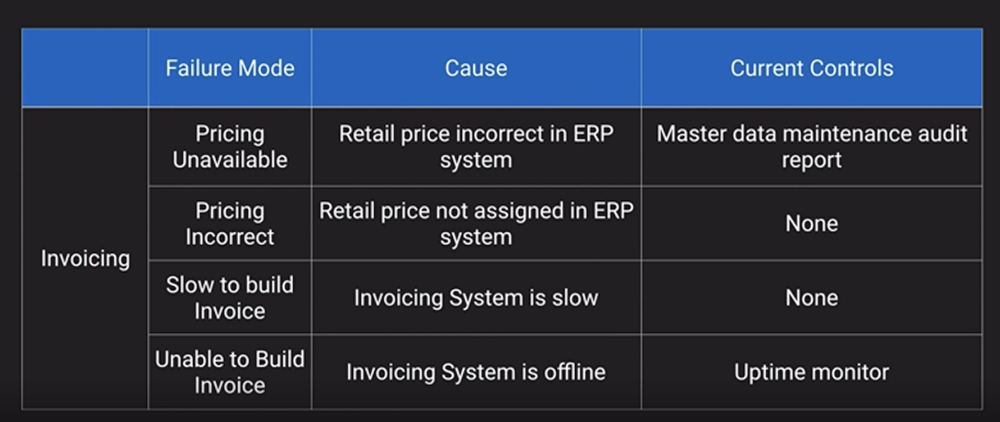
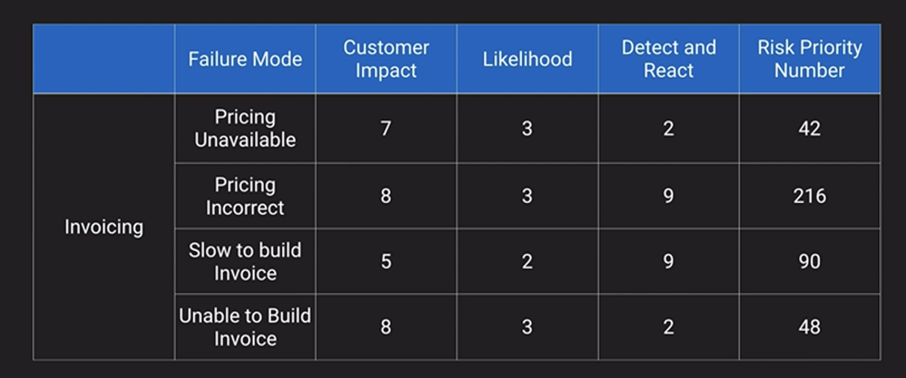
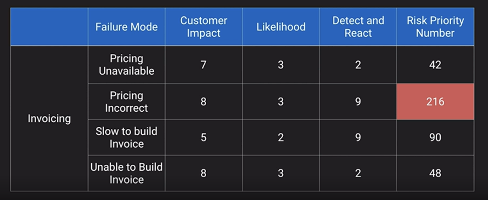

# Business Continuity Exam Tips

- Difference between Business Continuity, Disaster Recovery and Service Levels
- Difference between High Availability and Fault Tolerance
- Understand the inter-relationships and how AWS uses the terms
- Difference between RTO and RPO
- Four general types of DR architectures and trade-offs
- Storage Options
  - Understand the HA Capabilities and limitations of AWS storage options
  - Each storage option to achieve the required level of recovery capability
  - Understand RAID and potential benefits and limitations
- Compute Options
  - Why horizontal scaling is preferred (because you are spreading the risk over multiple machines) from an HA perspective
  - Understand how AutoScaling and ELB can contribute to HA
- Database Options
  - Know the HA attributes of various Databases services
  - Understand the different HA approaches and risks for Memcached and Redis
  - Know which RDS options require manual failover and which are automatic
- Network Options
  - Know which networking components are NOT redundant across AZs and how to architect for them to be redundant.
  - Understand the capabilities of Route 53 and Elastic IP in context of HA.

## Pro Tips

- Failure Mode and Effects Analysis (FMEA)
  - A systematic process to examine:
      1. What could go wrong
      2. What impact it might have
      3. What is the likelihood of it occuring
      4. What is our ability to detect and react
    - You create a formula
      - Severity * Probability * Detection = Risk Priority Number (RPM)
      - Severity * Probability + Detection = Risk Priority Number (RPM)

## FMEA Example

### Step 1 - Look at your process

### Step 2 - Assign Score (Higher number is worse)

### Step 3 - Prioritize on Risk

Implement Mitigations plans or additional redundancies or additional process around that potential process

*FMEA Could be useful for real world scenarios*

### [Business Continuity Challenge](../business-continuity-challenges/README.md)...
