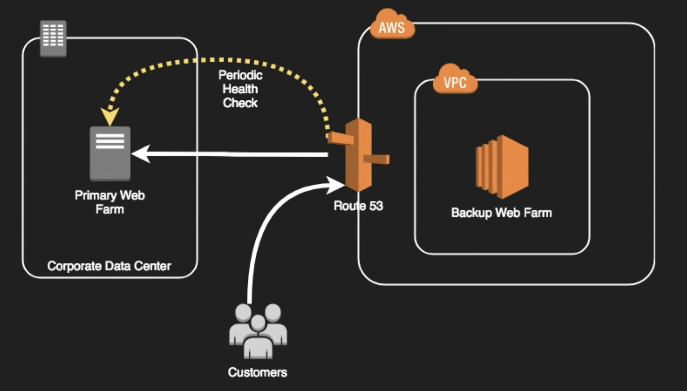

# Compute High Availability

- Up-to-date AMIs are critical for rapid fail-over
- AMIs can be copied to other regions for safety or DR staging
- Horizontally scalable architectures are preferred because risk can be spread across multiple smaller machines versus one large machine
- Reserved instance give you a higher priority for launching instances in a specific Availability Zone, but they do not guarantee that you will always be able to launch an instance. On-Demand Capacity Reservations guarantee that you will be able to launch an instance of the specified type in a specific Availability Zone, subject to availability at the time of reservation creation.
- Auto Scaling and Elastic Load Balancing work together to provide automated recovery by maintaining minimum instances.
- Route 53 Health Checks also provide “self-healing” redirection of traffic

### [Database High Availability Options](../database-high-availability/README.md)...