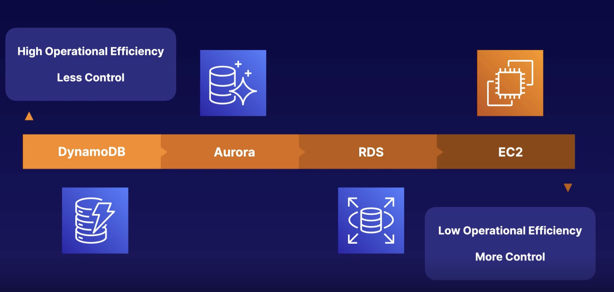
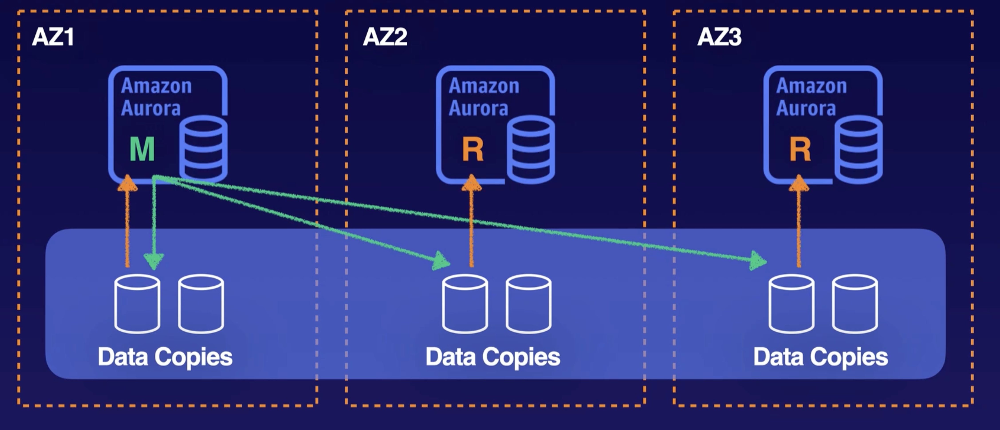
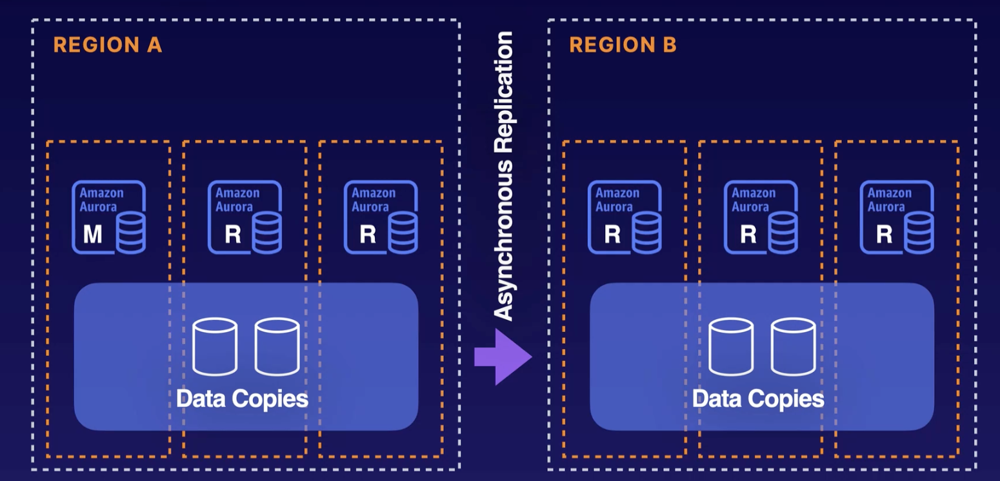
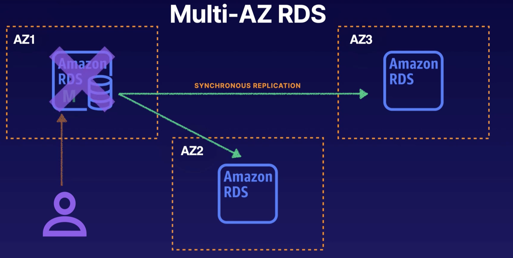
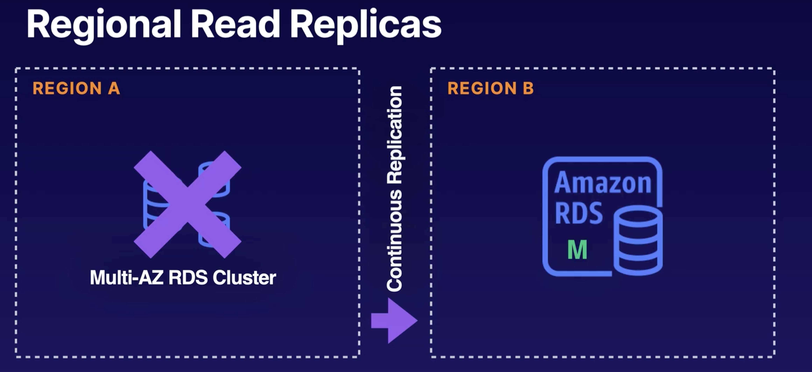
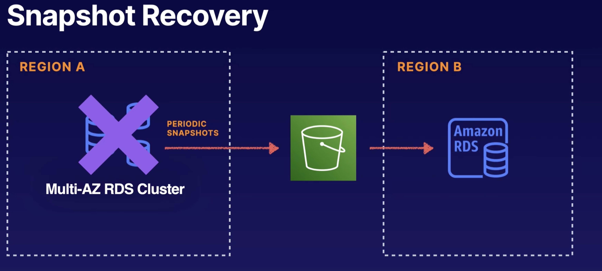
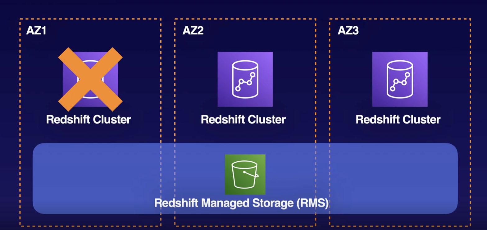
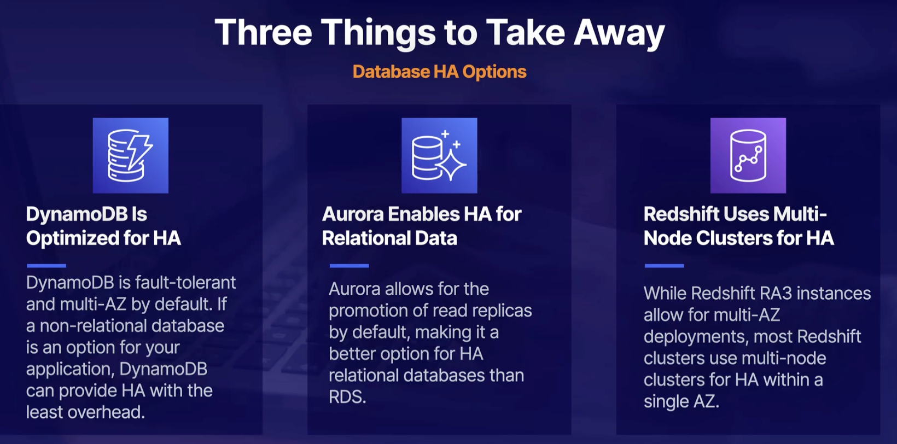

# Database High Availability

## DynamoDB High Availability

- Only works for NoSQL
- Control read and write
- Global table or regional table
- Distributes data and incoming traffic across partitions by default
- Partitions are replicated synchronously across three AZs in a Region
- Global Tables allow for multi-Region availability and fault tolerance

## Aurora High Availability

- Relational Data
- Main instances and multiple read replicates across availability zones within a region.
- Able to receive read traffic to all of those instances acting as backups to your main instance.
- In an event of a failure of your main instance, Aurora will automatically promote one of your read replicates to become the main instance.

### Up next [Business Continuity Tips](../business-continuity-tips/README.md)
