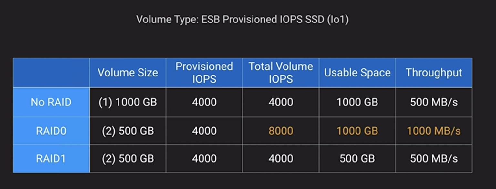
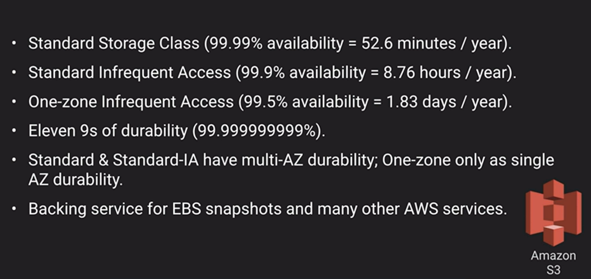
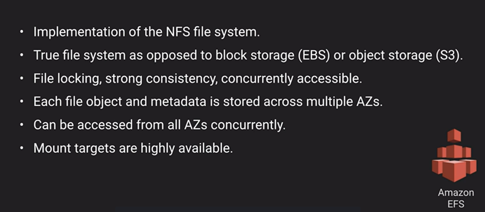
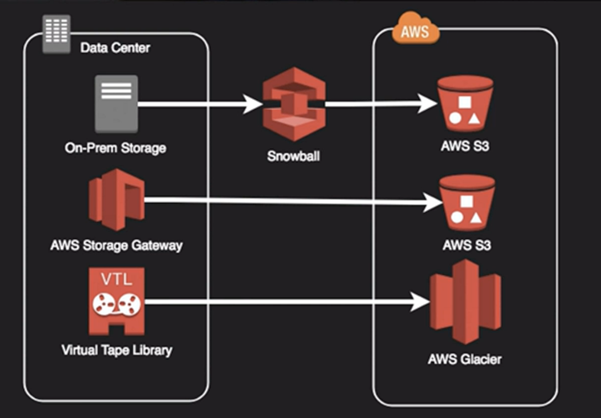

# Storage High Availability

## EBS Volumes

## Raid Configuration

## S3 Storage

## Amazon EFS

## Other options

### Up next [Compute High Availability](../compute-high-availability/README.md)...
