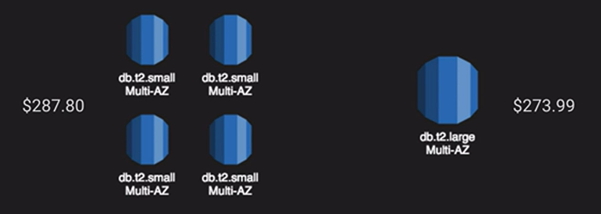
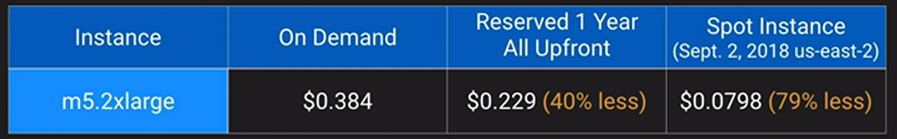
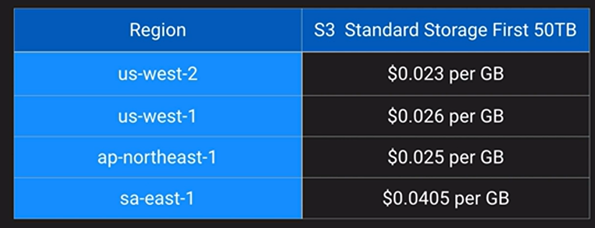
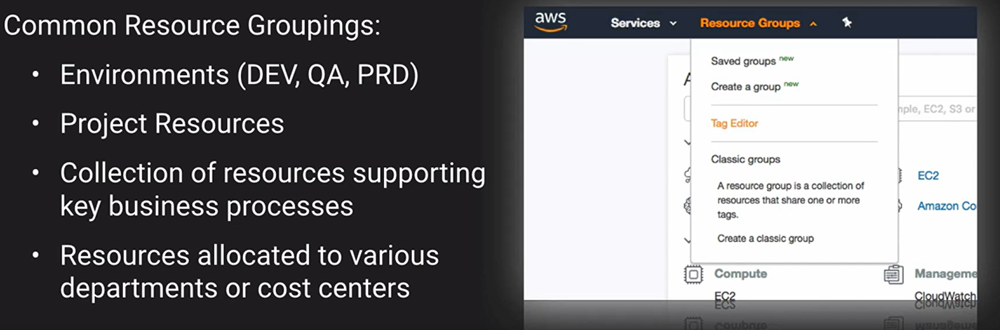
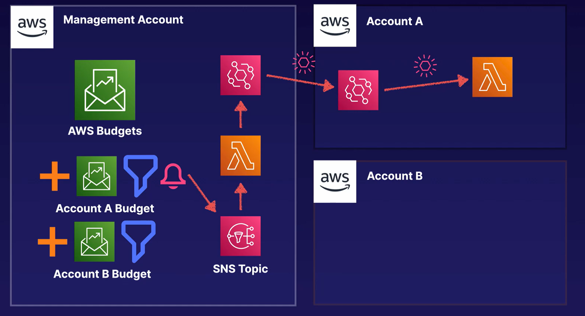
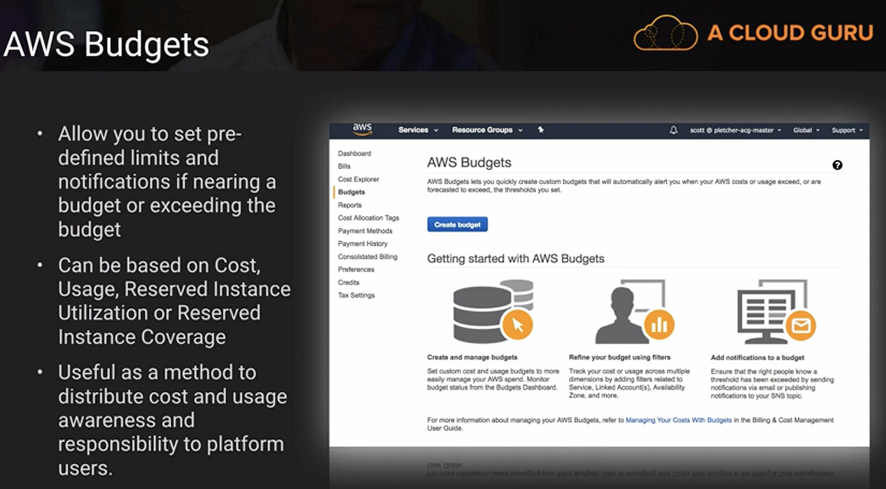
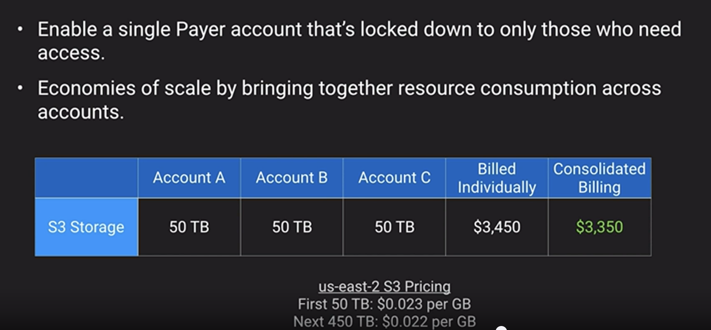
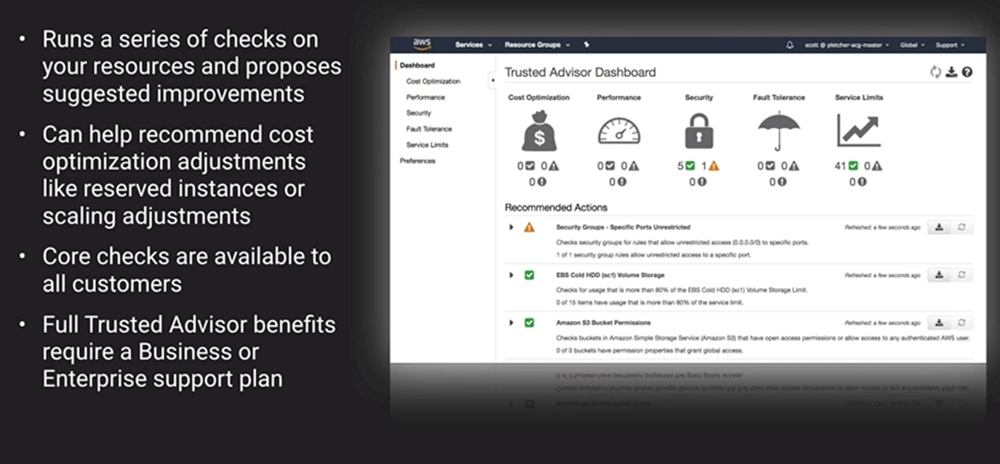

# Cost Management

## Capital Expenses (CapEx)

- Money spent on long-term assets

## Operation Expenses (OpEx)

- Money spent for on-going costs for running the business.
- Depreciation = over several years
- Pay as you Go is OpEx (AWS, Azure, GCP)
- Total Cost of Ownership (TCO)
  - A comprehensive look at the entire cost model of a given decision or option, often including both hard costs and soft costs.
- Return on Investment (ROI)
  - The amount an entity can expect to receive back within a certain amount of time given an investment.

## Cost Optimization Strategies

1. Appropriate Provisioning
  1. Provision the resources that you need.
  2. Consolidate for greater density and lower complexity
  3. CloudWatch can help by monitoring utilization

2. Right-Sizing
  1. Lower-cost resources that still meet technical specifications
  2. Architecting for most consistent use of resources is best versus spikes and valleys
  3. Loosely couples architecture using SNS, SQS, Lambda and DynamoDB can smooth demand and create more predictability and consistency

3. Purchase Options
  1. For permanent applications or needs, Reserved Instances provide the best cost advantage
  2. Spot instances are best for temporary horizontal scaling
  3. EC2 Fleet lets you define target mix of On-Demand, Reserved and Spot instances

4. Geographic Selection
  1. AWS Pricing vary region to region
  2. Route53 and CloudFront can be used to reduce potential latency or a remote region

5. Managed Services
    1. Leverage managed services such as MySQL RDS over self-managed options such as MySQL on EC2
    2. RDS, Redshift, Fargate and EMR are great examples of fully-managed services.

6. Optimized Data Transfer
    1. Data going out and between can become significant
    2. Direct Connect can be more cost effective.

## AWS Tagging

- A tag is a custom attribute that can be added to almost any AWS resources.
- AWS Tagging Whitepaper.
- As metadata
- Can be used as Cost Allocation, Security, Automation, etc.
- For example:
  - Tag an IAM policy to implement access controls to certain resources
- Most resources can have up to 50 tags

### Resource Groups

- They use tags to group AWS assets.
- Create custom consoles to consolidate metrics, alarms and config details around given tags

## Managing Costs Across Accounts

- Cost and Usage Reports can generate CSV
- Consolidated billing enabled can track spending across your Organization
- Further analyze them with Athena, Redshift and QuickSight
- Establish centralized budget
  - You can create budget that filter for each account
  - Setting up the alerts through a SNS Topic, you can have automation to shut down resources and alert administrators.
  

## Reserved Instances

- Purchase usage of EC2 instances in advance
- Provides capacity reservation when used in a specific AZ
- AWS Billing automatically
- EC2 has three RI types: Standard, Convertible and Scheduled
- Can be shared across multiple accounts with Consolidating Billing

## Cost Management Tools

- AWS Budgets

- Consolidated Billing
  - Single Payer account that’s locked down.
  - Economies of scale by bringing together resource consumption across accounts

- Trusted Advisor

### [Cost Management Tips](./cost-management-tips/README.md)...
