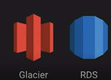
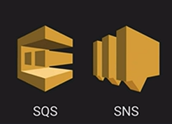
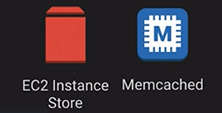
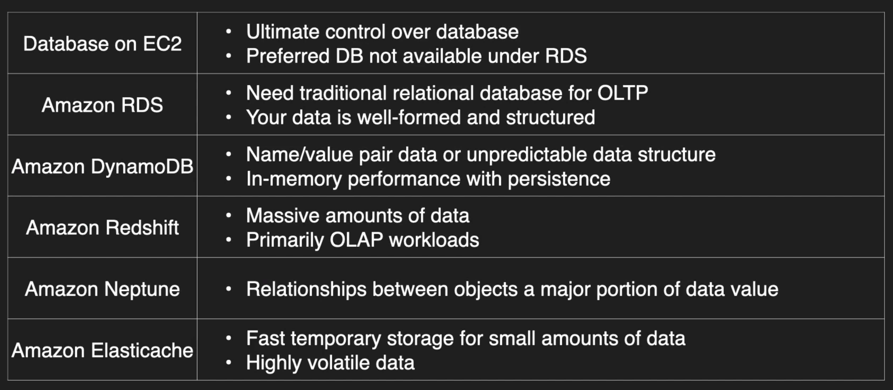

# Data Stores

## Database Foundamentals Concepts

- Persistance Data Store: Data is durable and sticks around after reboots, restarts or power cycles.

    

- Transient Data Store : Data is just temporarily stored and passed along to another process or persistent store.

    

- Ephemeral Data Store: Data is lost when stopped

    

- IOPS - Input/Output Operations per second
- Throughput - Measure of how much data can be moved at a time

### ACID vs Base

- Atomic, Consistent, Isolated, Durable
- Basic Availability, Soft-State, Eventual Consistency

### Comparing Databases

### Next Up [S3](./amazon-s3/README.md)....