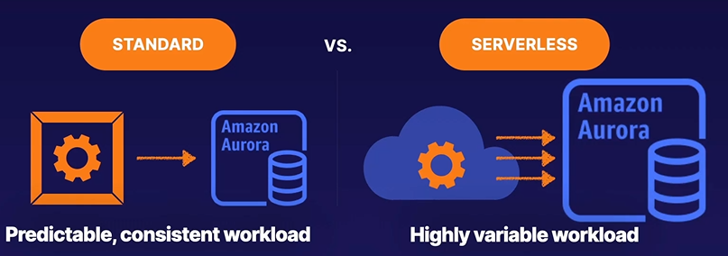
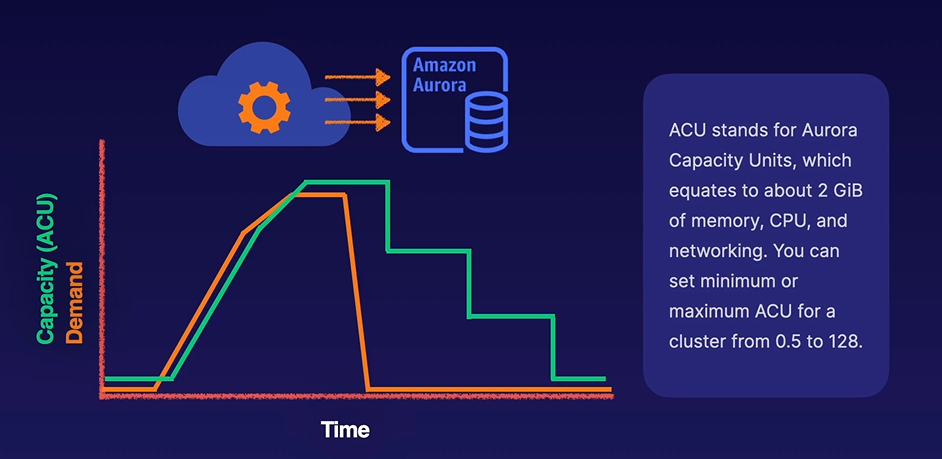

# Amazon Aurora Serverless

Aurora Serverless works best for highly variable workload

When provisioning Aurora Serverless, capacity is measured based on ACU (Aurora Capacity Units)

## Use Cases

1. MySQL and PostgreSQL database
2. Inherently high available and resilient to failure
3. Aurora Serverless is available for highly variable workloads
4. Low operation overhead

## Takeaways

1. Designed for High Availability - Aurora stores data redundantly within and across availability zones. Failover and data storage scaling is handled automatically.
2. Read Replicas Allow for Low Latency - Read replicates can be provisioned across availability zones to distributed read traffic. Global databases can be used to span across regions.
3. Amazon Aurora Serverless V2 allows you to provision instances that automatically scale their memory, CPU and network capacity.

### Up next [Amazon DynamoDB](../amazon-dynamoDB/README.md)...