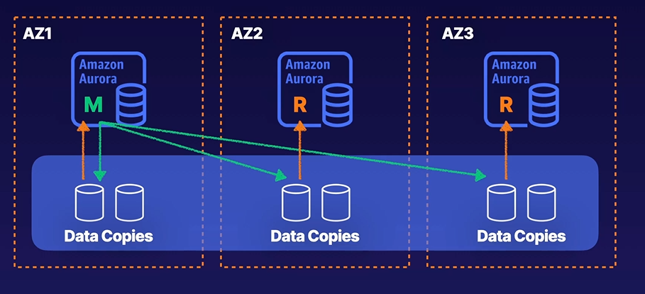
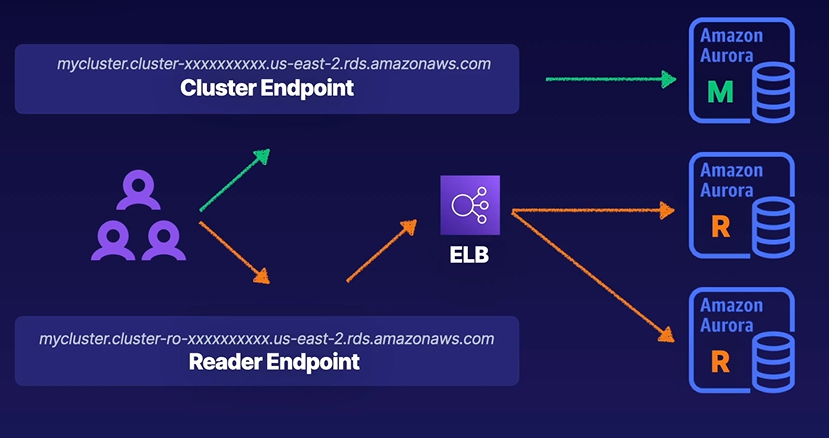

# Amazon Aurora

Aurora is a fully-managed database for RDS services for MySQL and PostgreSQL databases. It is multi-az availability by design, AWS-managed auto scaling and easier multi-region replication.

## Read Replicas

When you provision multi instances and this can span multiple availability zones. This instances handle the compute and networking access of Amazon Aurora. You can have one main instances and up to 15 read replicas. The data is help on data distributed along the availability zones. And it is independentt from the instances you provisioned.

It can scale independently. Your main instances handles all write traffic. Writing to all data copies and this replication is really fast. One data is written, it usually is available to read within 100 ms. And the main instances or any of the read replicas can handle read traffic. Great for read heavy application and automatically manages high availability.

## Global Databases

You can create read replicas across regions (latency is usually around 1 second). It is useful for high availability and disaster recovery.

- One primary region and up to five secondary regions.
- Data replicates from primary to secondary regions with low latency.
- Leverages storage-level replication for transferring data.
- Secondary region can be promoted in case of outage.

### Up next [Amazon Aurora Serverless](../amazon-aurora-serverless/README.md)...