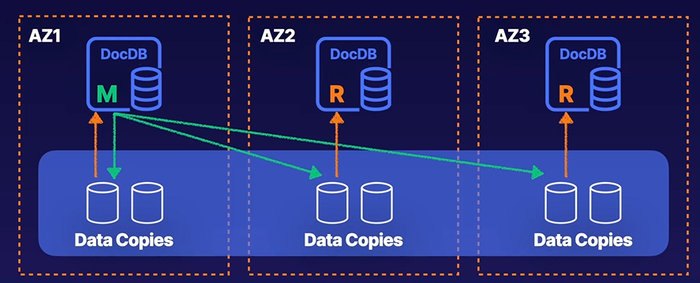
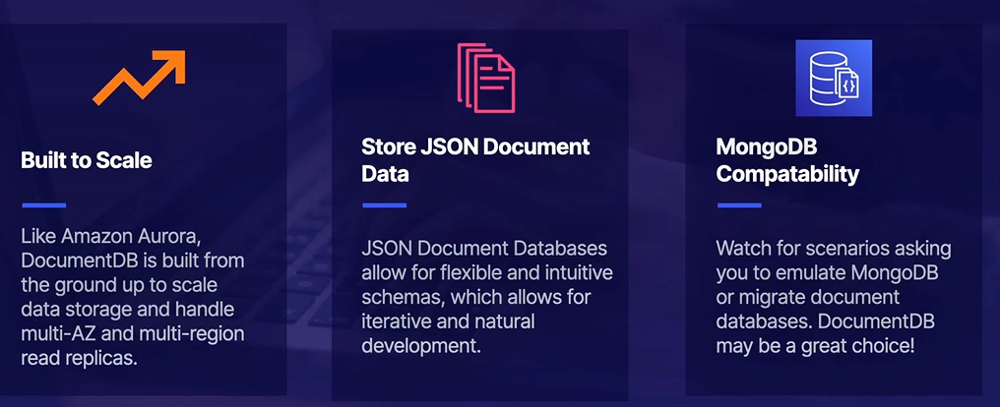

# Amazon DocumentDB

Its a AWS-native document data storage service. It is a managed database service that stores NoSQL JSON data in the form of documents.

- It is compatible with MongoDB
- Has AWS-managed auto scaling
- Supports write-then-read consistency

A document is a JSON blob and contain data that is intuitively structured for developers. 

- One main instance and 15 read replicas.

### Up next [Amazon Redshift](../amazon-redshift/README.md)...