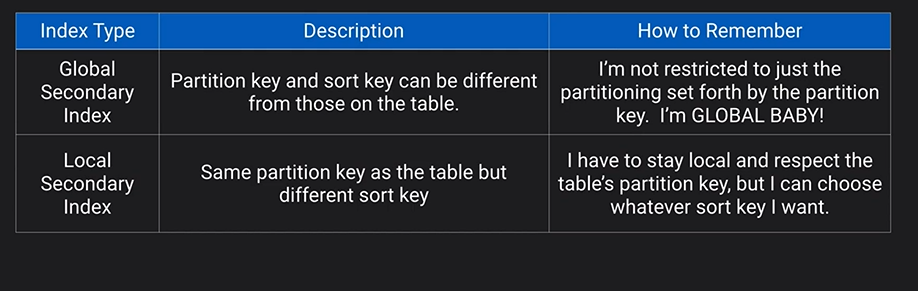
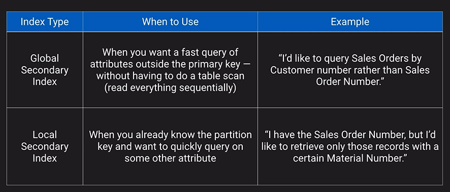
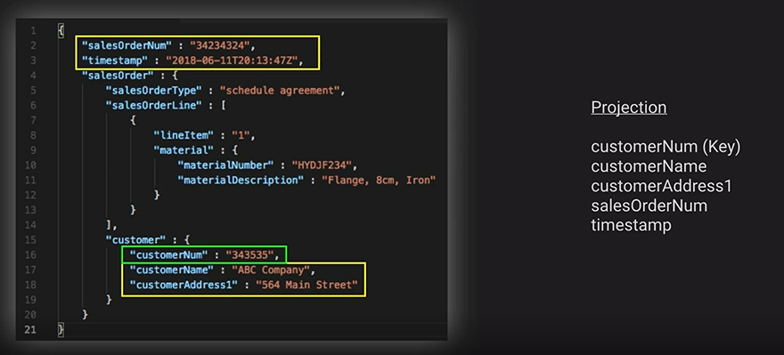
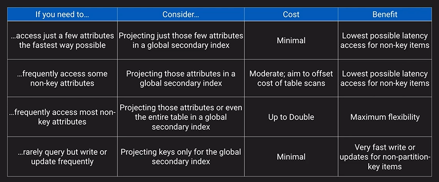
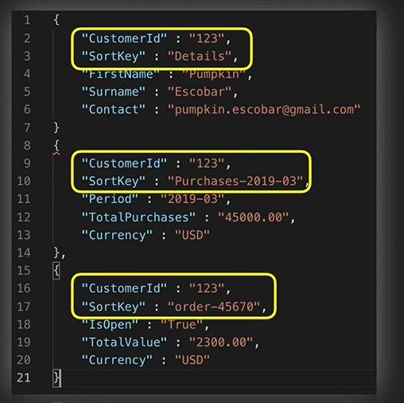
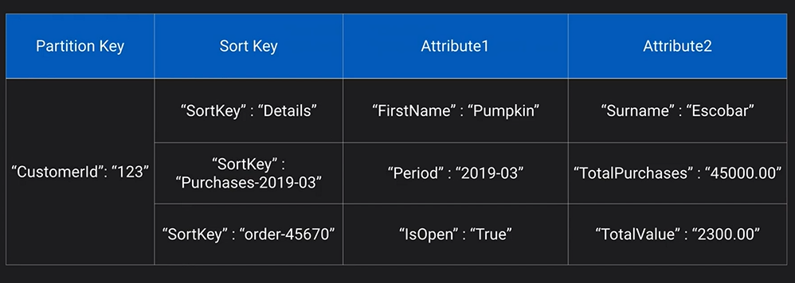
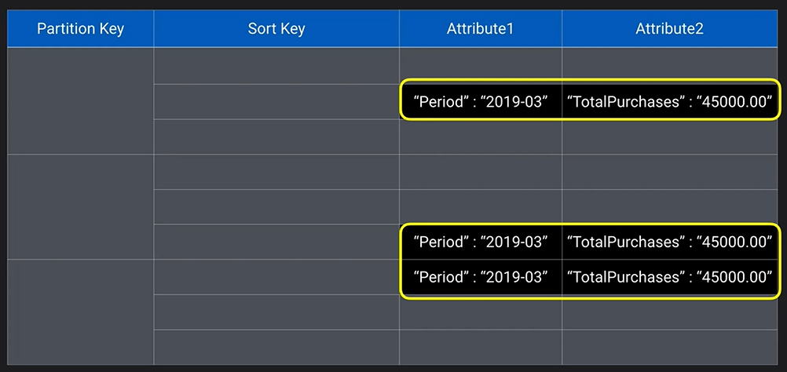
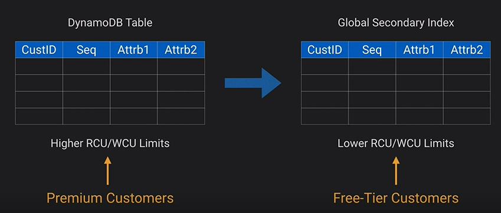
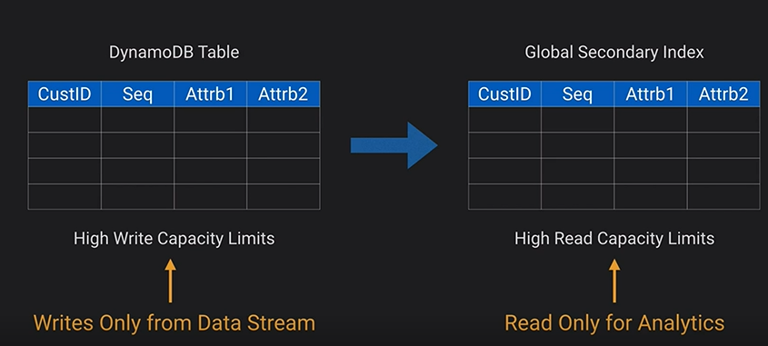

# Amazon DynamoDB

NoSQL excels in name value pairs. They are now as an attribute and a collection of items is a table. A primary key must be unique. Relational Databases are best when the data has a relationship. DynamoDB is a managed, multi-AZ NoSQL data store. It has available cross-region replication. It takes a while for the writes to be propagated across all AZ, hence it defaults to eventual consistency reads. However, one can request strongly consisted read via the SDK parameter.

- DynamoDB on being the more base compliant of the consistency model
- However, it can go ACID
- It is priced on throughput
- It can also do autoscaling capacity adjusts per configured min/max levels
- On-demand capacity for flexible capacity at a small premium cost.
- Achieve ACID compliance with DynamoDB Transactions
- Relational Databases are best when the data has a relationship.

### Secondary Indexes

### Attribute Projection

### Design Practices

Three different record, they share the commin partition key but they have different values for the sort key.

Update or pull total purchases across all customers? We can define a Global Secondary Index with Period as primary key and TotalPurchases as an attribute. Now we can perform aggregation based on date.

### Sparse Indexes

A feature of DynamoDB is that you will notice that not every record has an attribute called period. A neat trick of DynamoDB is that the index will only exist for those items that have the period attribute. Which means the index is smaller and will incur fewer reads and writes.

### Table Replicas

Use the same partition key and sort key and some other attributes. If we have two tier of customers.

Another use case might be for performance index:

The replica is eventually consistent.

### Up next [DocumentDB](../amazon-documentdb/README.md)...
