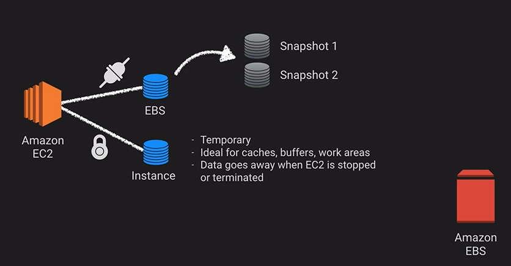

# AWS ELB

AWS Elastic Block Storage can only be used with AWS EC2. It is tied to a single availability zone. It is similar to a "virtual hard drive".

Snapshots are a great way to store a moment in time space. Here are a couple facts of snapshots:

- Cost-effective and easy back strategy
- Share data sets with other users and accounts
- Migrate a system to a new AZ or Region

### Amazon Data Lifecycle Manager

Amazon's way to schedule snapshot for volumes or instances every X hours. Retention rules to remove stale snapshots.

### Up next [Amazon Elastic File Service](../amazon-elastic-file-service/README.md)...