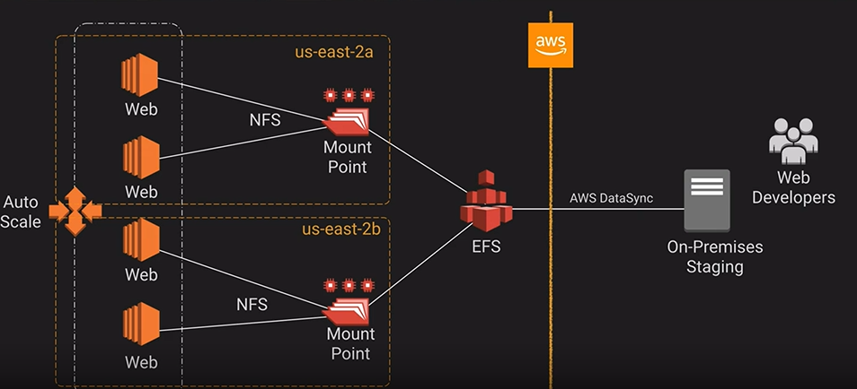
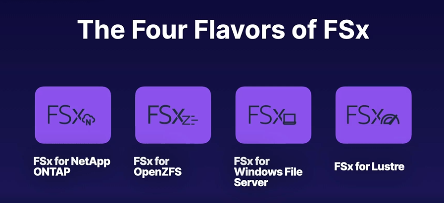
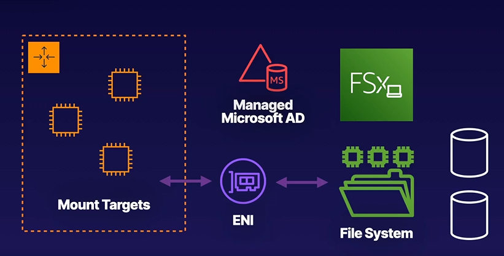
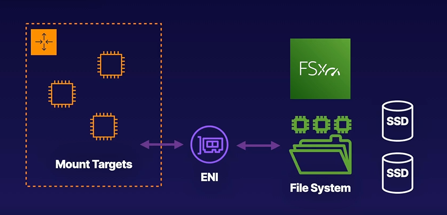
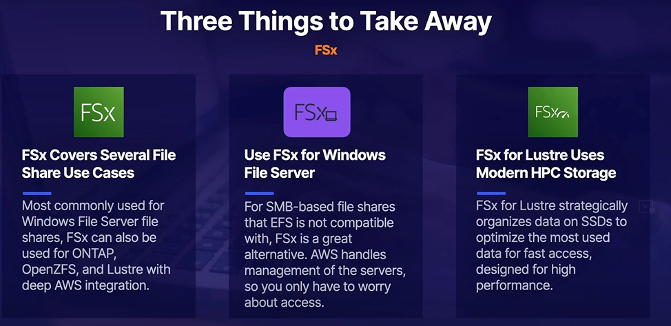

# AWS EFS

Amazon Elastic File Share is an implementation of NFS file share. It is a type of elastic storage capacity and pay for only what you use. Here are the facts

- Multi-AZ metadata and data storage.
- Configure mount-points in one, or many AZs.
- Can be mounted from on-premise system through Amazon Direct Connect.
- You can use DataSync.
- It is 3x times more expensive than EBS.
- It is 20x times more expensive than S3.

## AWS FSx

An alternative to EFS, where EFS file storing cannot be solved. AWS FSx is a distributed file system. It integrates with Windows file service and provides a non-network file system.

### Four options

1. FSx for NetApp ONTAP
2. FSx for OpenZFS
3. FSx for Windows File Server
4. FSx for Lustre

Here are a couple facts:

- You can use an ENI(Elastic Network Interface) to connect with it
- A file system has an endpoint
- You can use IAM roles or managed Microsooft AD
- It is a good use case for Windows Line of business application.
  - Windows content management system
  - Media Processing workflows
  - Windows data anayltics

## AWS FSx for Lustre

AWS FSx for Lustre is for high-performing distributed applications and for high-performing compute clusters. It can reliability interact with thousands of EC2 instances. It is a great use for big data and machine learning applications.

## Tips for FSx

### Next up [Amazon Storage Gateway](../amazon-storage-gateway/README.md)...