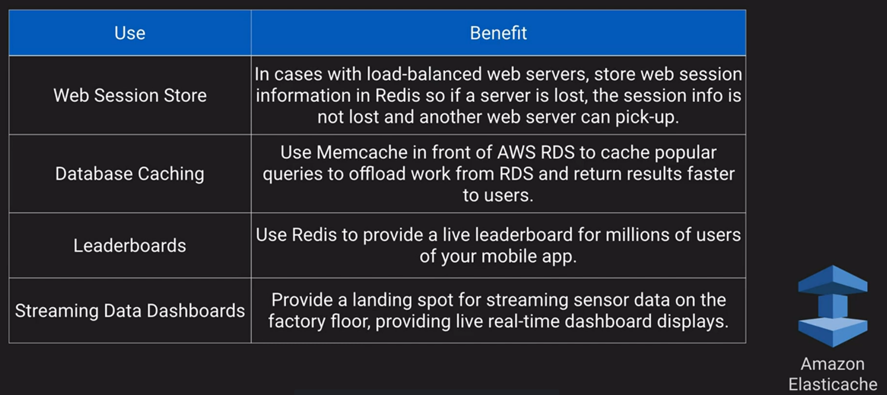
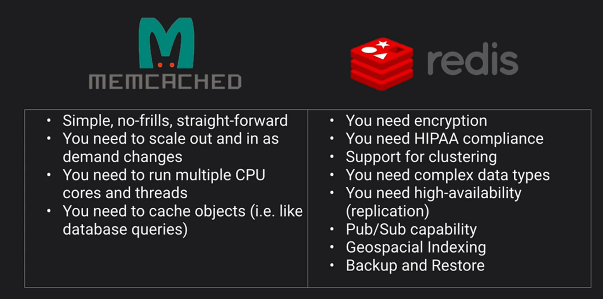

# Amazon Elasticache

It is a fully managed implementation of two popular in-memory data stores - Redis and Memcached. It offers push-button scalability for memory, writes and reads. It is stored in memory key/value store. It is billed by node size and hours of usage.

VPC does not support multicast only single cast.

The following engines are avaible for Amazon Elasticache. Memcached simple and Redis is the fancy option.

### Up next [Amazon Quantum Ledger Database](../amazon-quantum-ledger/README.md)...
