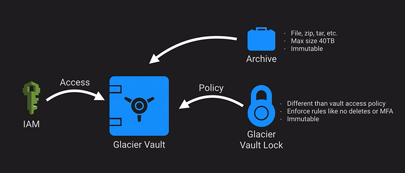

# AWS Glacier

AWS Glacier is cheap and slow to respond. Another option is AWS Storage Gateway Virtual Tape Library. It is best used for archiving data.

It is integrated with AWS S3 via Lifecycle Management.

- Policies define what rules the vault must obey
- Access through IAM, roles to people
- Glacier Vault Lock is immutable
  - Allows 24 hours before aborting

### Up next [Amazon Elastic Block Storage](../amazon-elastic-block-storage/)...