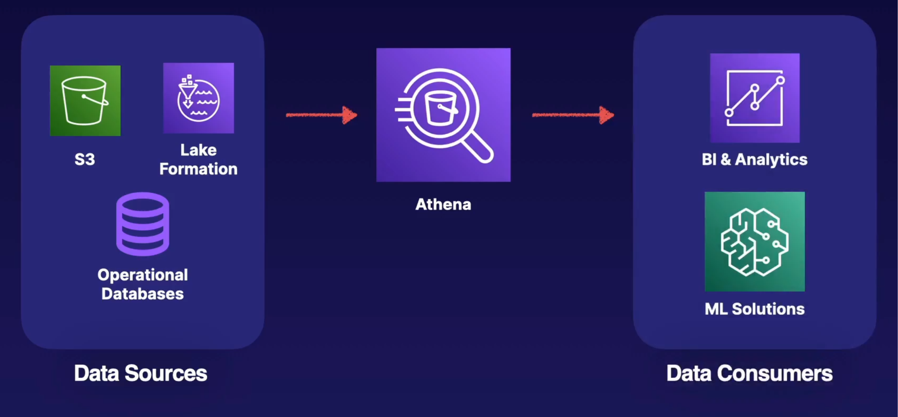

# AWS Glue and Amazon Athena

Preparing data fro analytics. The following data ecosystem is made possible to gain insights from data.

## AWS Glue main service for ETL at scale.

- Allows you to discover data with Glue Crawlers which can collect data from multiple data sources.
- Allows you to prepare data with Glue Data Catalogs and Glue ETL Jobs.
- Integrate data from disparate sources
- It is also serverless

1. Glue Crawler - Collect data that meets certain formats
2. It stores the metadata to where to find the relevant data in a Glue data catalog
3. Glue Data Catalog can be leverage directly by services like EMR, Redshift or Athena, and can do searches on the subset of data that you defined on the data catalog
4. Define Glue ETL Jobs, can run on schedule or response and transform the data defined in a data catalog and then load into a new data source.
5. Lake Formation, Redshift, S3 or CloudWatch may be your final destination and you can deliver them to a data consumer, such as Amazon QuickSight.

AWS Glue also has a feature called **Glue Data Quality** which allows you to define rules to ensure the quality of your data.

## Amazon Athena

Amazon Athena is best for analyzing petabyte-scale data where it lives. It is a SQL Engine overlaid on S3 base on Presto. Query raw data object as they sit in a s3 bucket. Use or convert your data to Parquet format if possible for a big performance jump.

- Serverless big data querying service
- Designed to create database form S3 objects
- Uses standard SQL to create queries
- Can run Spark code with Apache Spark on Amazon Athena

Define federated queries to analyze data from over 25 different data sources.

### Up next [Amazon Neptune](../amazon-neptune/README.md)...