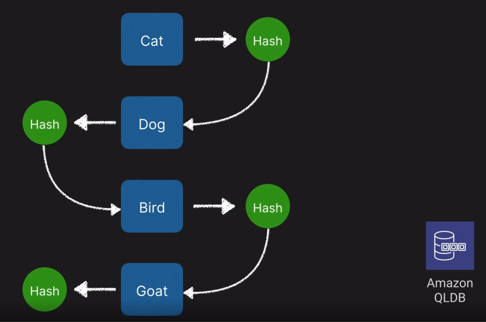

# Amazon Quantum Ledger Database

- Based on blockchain concept
- Provides an immutable and transparent journal as a service without having to set up and maintain an entire blockchain framework
- Centralized design (as oppose to decentralized consensus-based design for common blockchain frameworks) allows for higher performance and scalability
- Append-only concept where each record contributes to the integrity of the chain

### Up next [Amazon Managed Blockchain](../amazon-managed-blockchain/README.md)