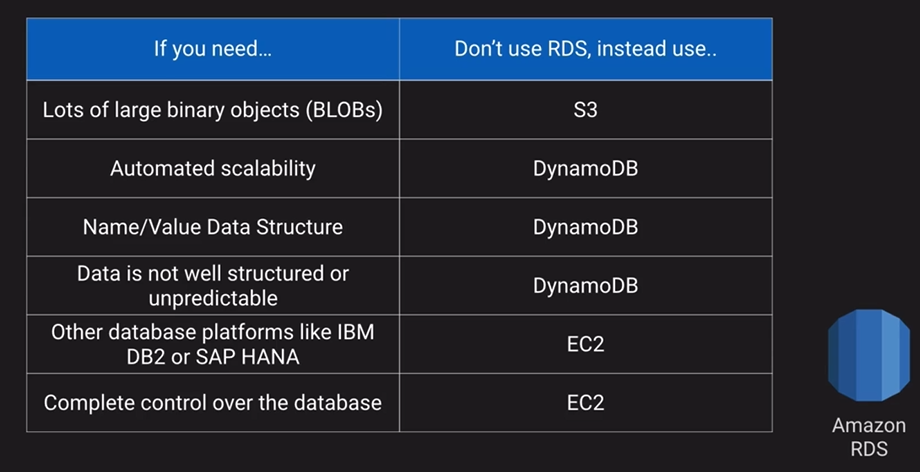
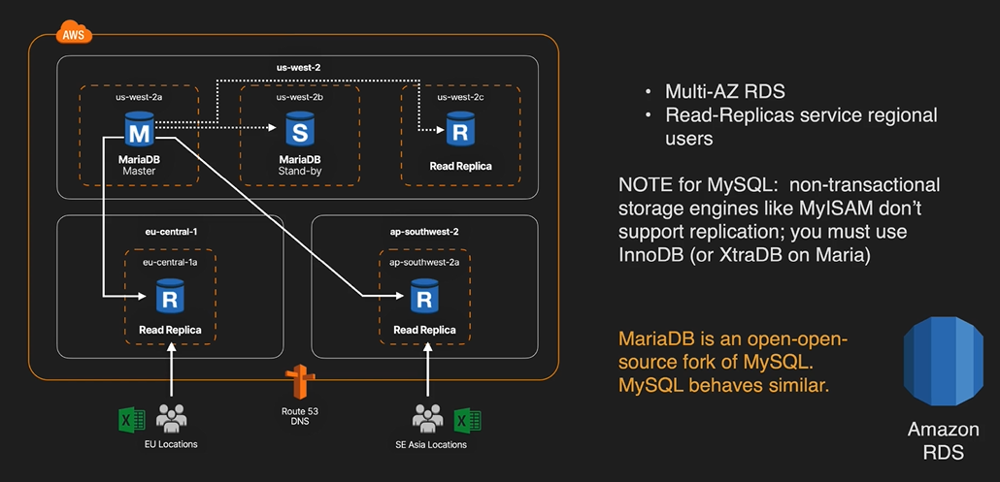

# AWS RDS

A managed database service for strucutre, relation databases (MySQL, Maria, PostgreSQL). aims to be drop-in replacement for existing on-premise instances of same databases. Provides automated backups and patching in customer-defined maintenance windows.

### Anti-patterns for Amazon RDS

### Architecture

The master database in us-west-2a and the two stand-by in the other availability zones. We also have a real replicate in eu-central-1a and ap-southwest-2a to service the users in those regions. To use replication you have to use InnoDB or XTraDB on Maria

#### Types of replications

1. Sync replication

In a multi-az implementation the replication between the Master and the Stand-by is synchronous. As soon as the transaction gets committed, it is instantly replicated to those other standbys. If the Master fails, the Stand-bys standup and say I am now the Master and have all the data the Master had.

2. Aysnc Replication

Read replicas are asynchronous replication. They could lag a few seconds or minutes with the regards to the writes that are occurring in the master.

If our master dies, in a multi-AZ deployment, one Standbys get promoted to the master and it continous to serve as the master for the read replicas. If a whole region fails, we can promote one of our read replicas. However, it is a two step process:

- Promote the Read Replicate to a standalone in a single availability zone
- Reconfigure the single-az to multi-az

### Up next [Amazon Aurora](../amazon-aurora/README.md)...