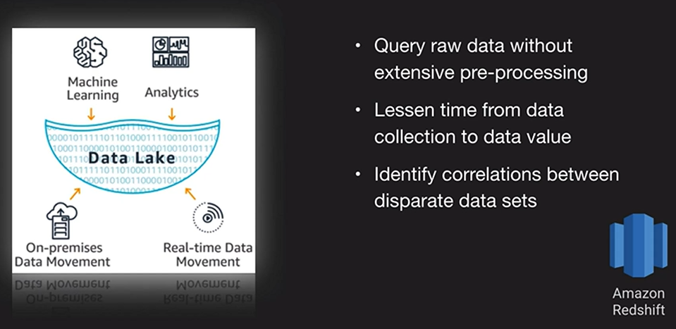
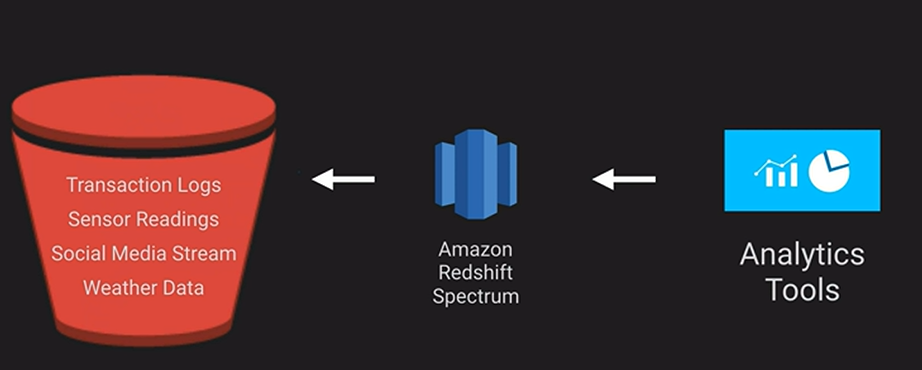

# Amazon Redshift

It is a fully managed, clustered peta-byte scale data warehouse. It is extremely cost-effective as compared to some other on-premise data warehouses platforms. It is PostgreSQL compatible with JDBC and ODBC drivers. It features parallel processing and columnar data stores which are optimized for complex queries. Options to query directly from data files on S3 via Redshift Spectrum.

## Data Lake

A large repository for a variety of data  on top of which you place some framework or technology to make use of it. The benefit is that you can shorten the distance from when you collect the data, to when you can make sense of it.

### Up next [Amazon AWS Glue and Athena](../amazon-glue-and-athena/README.md)...