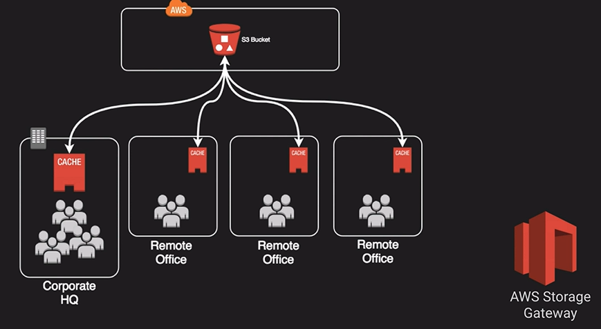

# Amazon Storage Gateway

Is a downloaded virtual machine that you can run on-premise with VMWare or HyperV or via a specially configured Dell hardware appliance. It provides local storage resources backed by AWS S3 and Glacier.

- Often used in disaster recovery preparedness to sync with AWS.
- Useful in cloud migration.

The Storage Gateway provides a feature called bandwidth throttling. In the example above, we are using AWS Storage Gateway in  Volume Gateway Cached Mode to provide syncronized file experience for the remote office. All data is still stored in S3 with those eleven nine's behind it. Providing access to just the data that those remote offices need.

### Up next [Databases on EC2](../database-on-ec2/README.md)