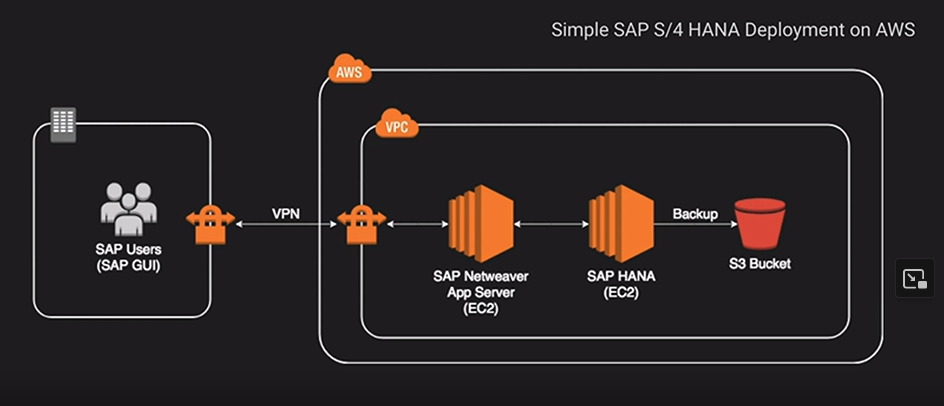

# Databases on EC2

You can run any database in EC2 and you have full control and ultimate flexibility. However, you must manage everything from backups, redundancy, patching and scale. It is a good option if you require a database not supported by RDS.

In the example above, SAP Hana database is not supported as a managed service by AWS.

### Up next [Amazon RDS](../amazon-rds/README.md)...