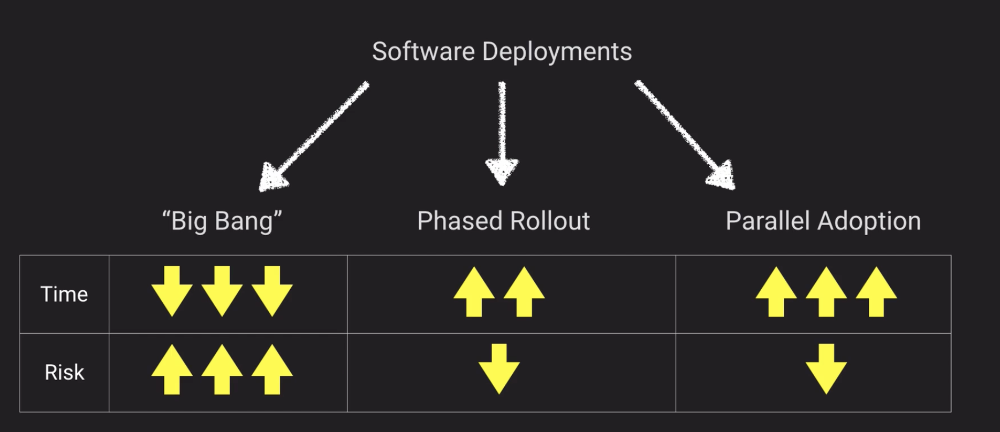
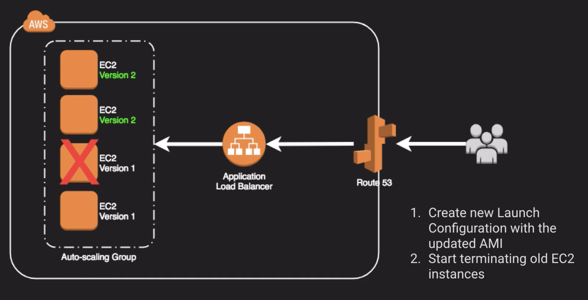
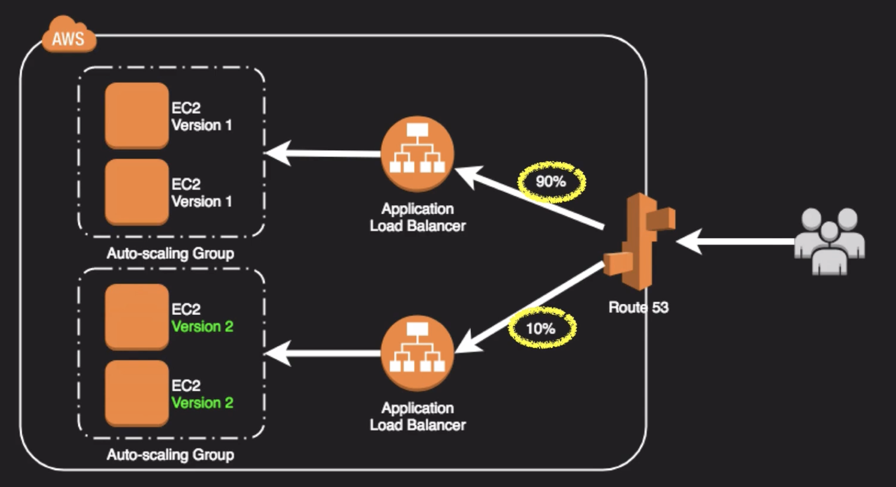
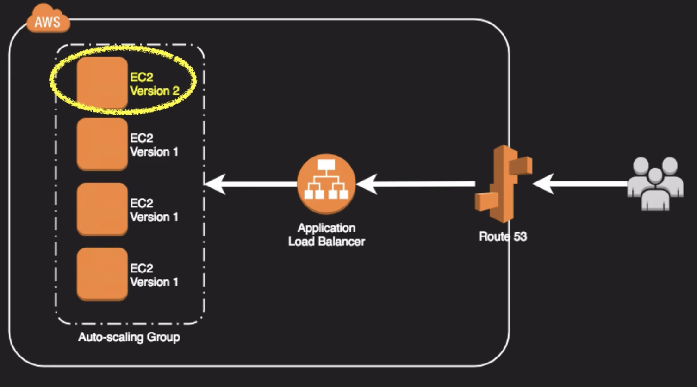
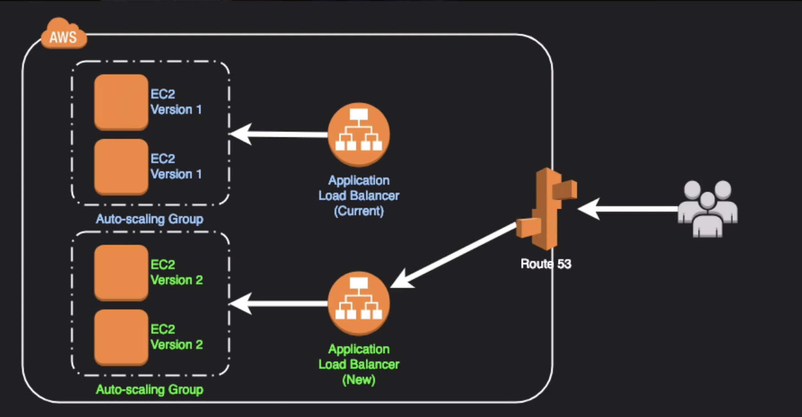
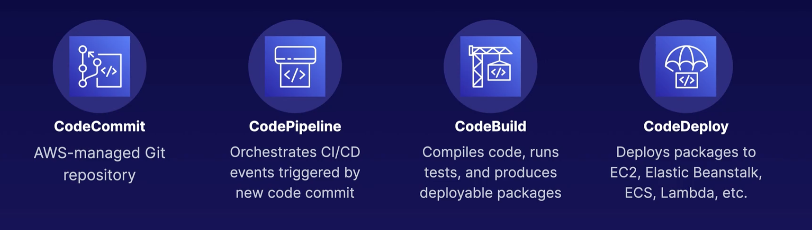
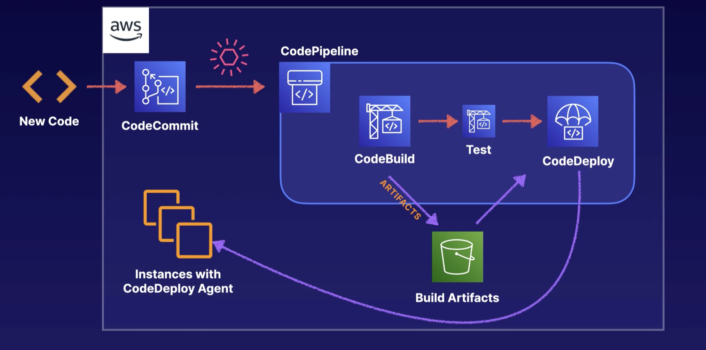
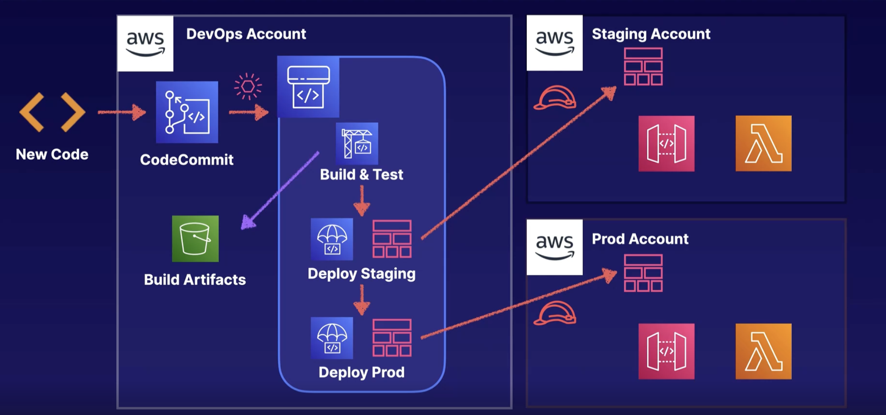
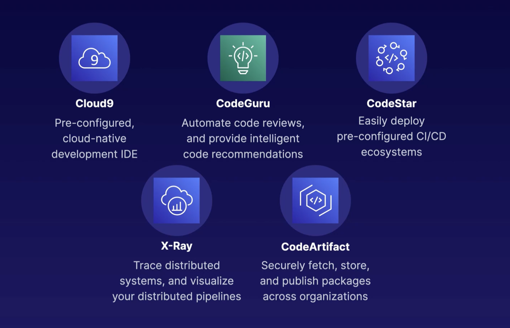

# Deployment and Operations Management

- Undestand IAC
- CI / CD
- AWS Systems Manager

## Types of Deployments

### Rolling Deployments

### A/B Testing

### Canary Release

### Blue / Green Deployment

- Update DNS with Route53 to point to a new ELB or instances
- Swap Auto-scaling Group already primed with new version instances behind the ELB
- Change Auto-Scaling Group Launch Configuration to use new AMI version and terminate old instances
- Swap environment URL of Elastic Beanstalk
- Cline stack in AWS OpsWorks and update DNS
- Blue Green Contraindication (Anti-patterns)
  - Data store schema is too tightly coupled to the code change
  - Update requires special upgrade routines to be run during deployment
  - Off-the-shelf products might not be blue-green deployment

## Deploying Infrastructure

- CI: Merge code changes back to main branch as frequently as possible
- CD: Automate your release process with the click of a button
- Continuous Deployment: Each code change triggers a series of automated release stages
- AWS Services

## Example Pipeline

## Multi-Account Pipeline

## Other CI/CD Services

### Up next [Deployment Management Services](../deployment-and-operations-mgmt/deploy-services/README.md)...