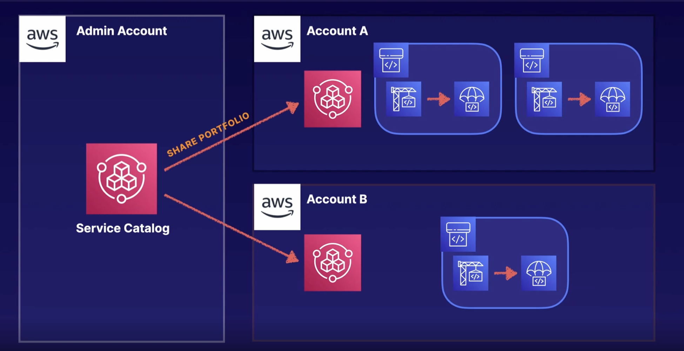

# Deployment and Management Services

- Elastic Beanstalk is an orchestration
  - Wide range of support platforms - from Docker to PHP

## Cloud Formation

- Infrastructure as Code
- Using JSON or YAML, you can model and provision entire landscapes
- Repeatable, automatic deployments and rollbacks
- Nest common components for reusability
- Supports over 300 Resource Types
- Components of CloudFormation
  - Templates - JSON or YAML text files that contains the instructions for building-out the AWS environment
  - Stack - The entire environment described by the template and created, updated, and deleted as a single unit
  - Change Sets - Summary of proposed changes to your stack that will allow you to see how those changes might impact your existing resource before implementing them.
- Stack Policies
  - Protect specific resources within your stack from being unintentionally deleted or updated
  - Add a Stack Policy via the console or CLI
  - Once applied, a Stack Policy cannot be removed - but it can modified via CLI

- Best Practices
  - AWS Provides Python “helper scripts”
  - Changes to your landscape rather than going directly into the resources
  - Make use of Change Sets to identify potential trouble spots in your updates
  - Use Stack Policies to explicitly protect sensitive portions of your stack
  - Use version control system to track changes to your stack

## StackSets

**Deploying Infrastructure Across Accounts - StackSets**
  - StackSets allow you to deploy and update a set of resources in multiple accounts or regions.

StacksSets it’s an integral part of managing multiple accounts with Control Tower. Control Tower automatically provisions a core organizational unit and allows  you to provision in custom organization units. And All of these accounts have what’s called a baseline applied to them. The Control Tower baseline gives it the ability to aggregate logs and make changes within its member accounts. It also applies config guard rails, and it does all of this using stack sets. When you provision a multiple account environment using Control Tower,  you are also going to be set up with AWS Service Catalog.

## Service Catalog

- Share templates across your organization
- Create and govern curated list of AWS products
- Allow users to provision resources without full access to AWS Services
- Portfolio can contain many products

## Things to take away

## Elastic Container Service

### Launch Types for EC2

## API Gateway

- Managed, high availability service to front-end REST APIs
- Backed with custom code via Lambda, as a proxy for another AWS Service or any other HTTP API on AWS or elsewhere
- Regionally based, private or edge optimized (deployed via CloudFront)
- Support API Keys and Usage Plans for user identification, throttling or quote management
- Can cache results
- Using CloudFront behind the scenes and custom domains and SNI are supported
- Can be published as products and monetized on AWS Marketplace
- Architecture Example

## AWS Config

- Allows you to assess, audit and evaluate configurations of your AWS resources
- Useful for Configuration Management as part of an ITIL program
- Create a baseline of various configuration settings and files then can track variations against that baseline
- AWS Config Rules can check resources for certain desired conditions and if violations are found, the resources is flagged as “noncompliant”
- Example of Config Rules
  - Is Backup enabled on RDS?
  - Is CloudTrail enabled on AWS account?
  - Are EBS volumes encrypted?

## AWS OPSWorks

- Managed instances of Chef and Puppet
- Provide configuration management to deploy code, automate tasks, configure instance, perform upgrades
- Has three offerings, OpsWorks for Chef Automate, OpsWorks for Puppet Enterprise and OpsWorks Stacks
- AWS OpsWorks Stacks
  - Stacks are collections of resources needed to support a service or application
  - Layers represent different components of the application delivery hierarchy
  - EC2 instances, RDS instances, and ELB are example of Layers
  - Stacks can be cloned - only within the same region

## AWS System Manager

- Centralized console and toolset for a wide variety of system management tasks
- Designed for managing a large fleet of systems - tens or hundreds
- SSM Agent enabled System Manager features and support all OSs supported by OS as well as back to Windows Server 2003 and Raspbian
- SSM Agent installed by default on recent AWS-provisioned base AMIs for linux and windows
- Manages AWS-based and on-premise based system via the agent

## Path Manager Baselines

- Uses a baseline to manage which patches are auto approved for being applied.

## AWS System Manager Documents

## Enterprise App

- Amazon AppStream and Workspaces
  - Fully managed desktop-as-a-service (Workspaces) and application hosting (AppStream)
  - Everything lives on AWS Infrastructure and can be tightly managed and controlled
- AWS Connect
  - Fully managed cloud-based contact center solution with configurable call handling
  - Can integrate with CRM systems
- Amazon Chine
  - Online meeting and video conferencing
- Amazon WorkDocs
  - Online document storage and collaboration platform
- Amazon WorkMail
  - Fully managed email and calendar as-a-service
- Amazon WorkLink
  - Provide secure access to internal web application for mobile devices
- Alexa For Business
  - Deploy Alexa functionality and skills internally in your enterprise

### [Machine Learning and IoT](../deploy-ml-and-iot/README.md)...
