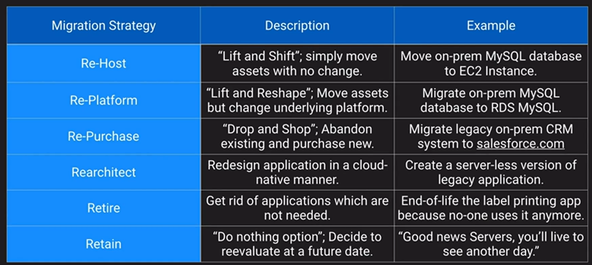
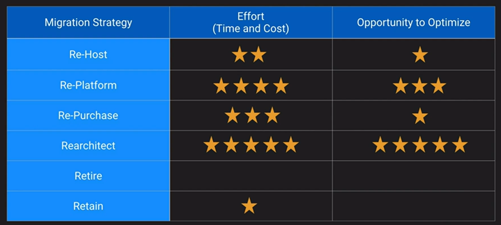
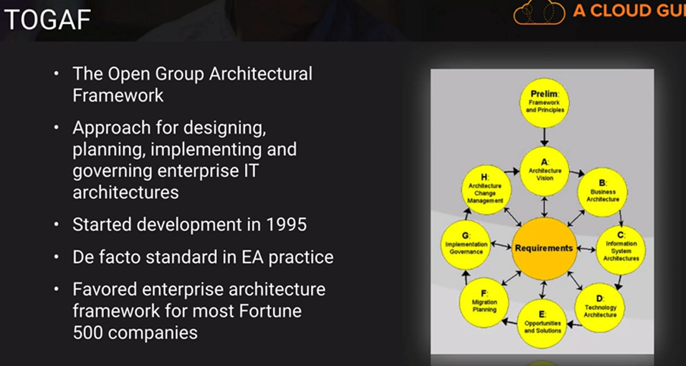
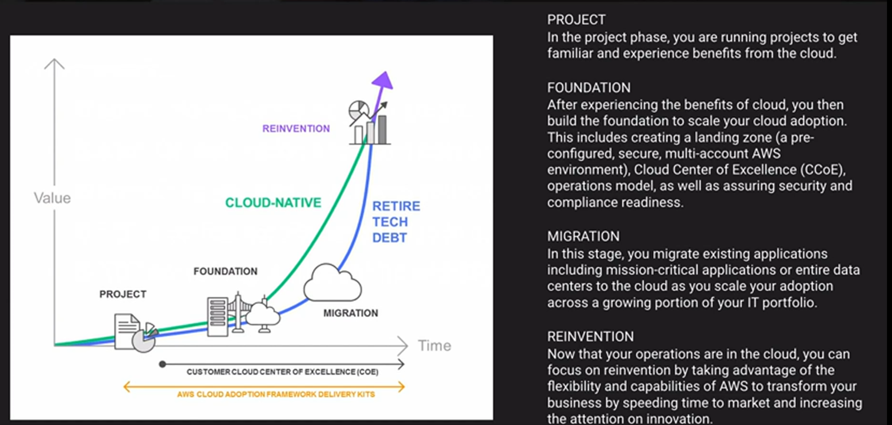
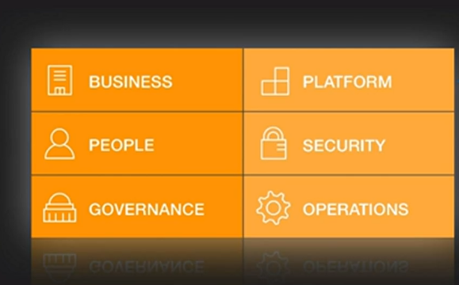
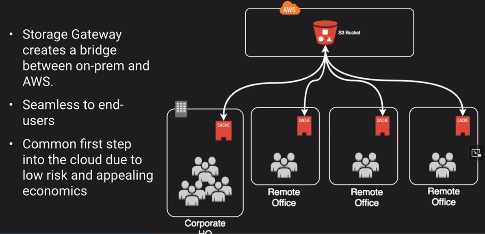
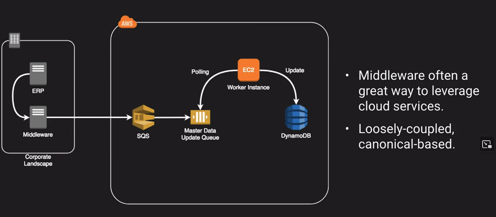
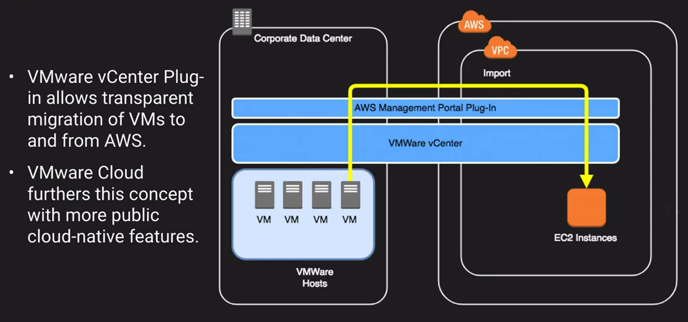
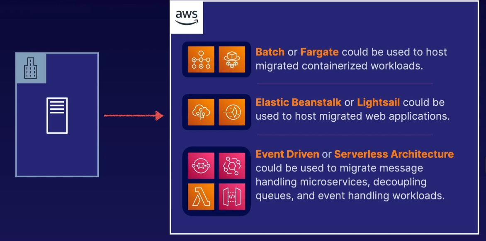

# Migrations Strategy

## Cloud Adoption Framework

- Enterprise Architecture is not TOGAF
- TOGAF is not a cookbook
- Boundary Spanners

## Typical Cloud Journey

## Cloud Adoption Framework

## Hybrid Architecture

- Makes use of cloud resources along with on-premise resources
- Infrastructure can augment or simply be extensions of on-prem platforms
- Integrations are loosely couples — meaning each end can exist without extensive knowledge of the other side

Examples of Hybrid Architecture:

## Migrating Applications

1. Already Containerized could run on Batch or Fargate
2. Running Tomcat application on-premise you could use Elastic Beanstalk or Lightsail
3. Cron jobs or event drive you can use serverless architecture

### [Migration Hub](./migration-hub/README.md)...
