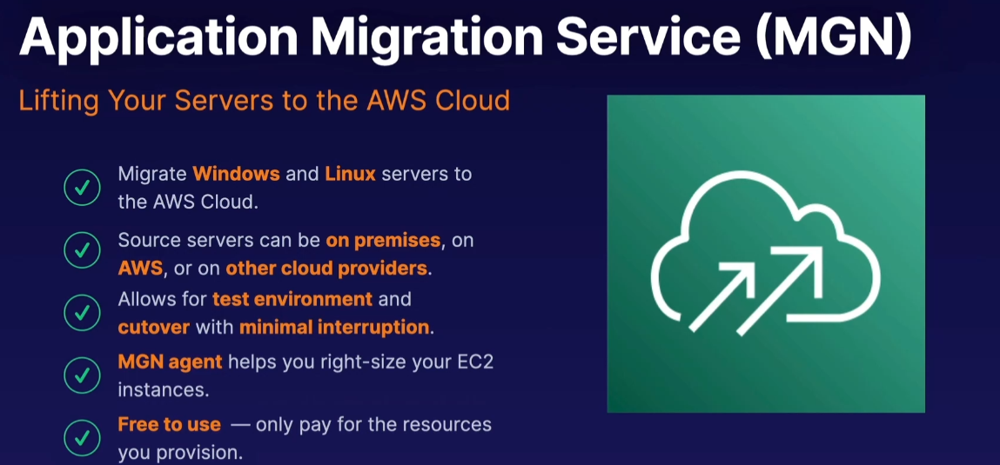
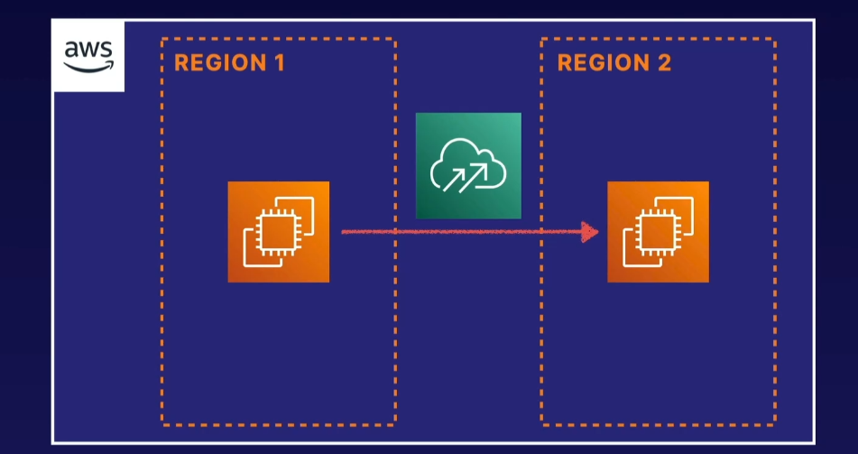
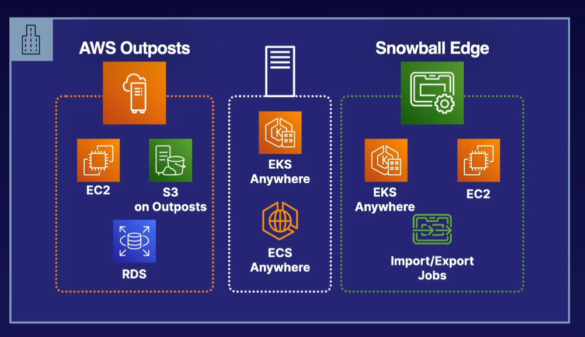
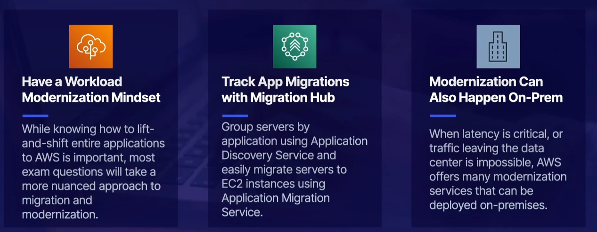

# Application Migration Service (MGN)

MGN can also be used to replicate across regions

## Bringing AWS to your Data Center

1. You can run EKS Anywhere/ECS Anywhere on Bare Metal.
2. You can order AWS Outposts. Physical server that can preconfigured to run AWS services.
3. You can order a device called Snowball Edge

### [Migrating Data](../migrating-data/README.md)...
