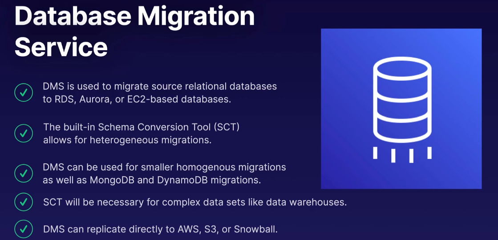
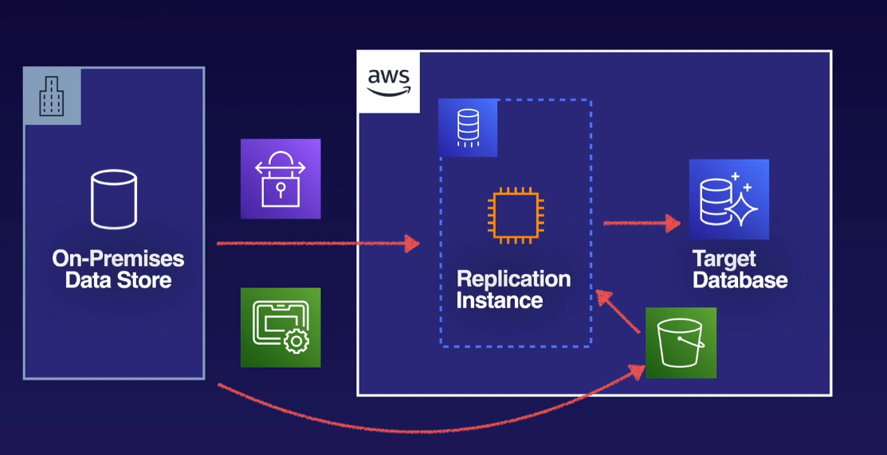
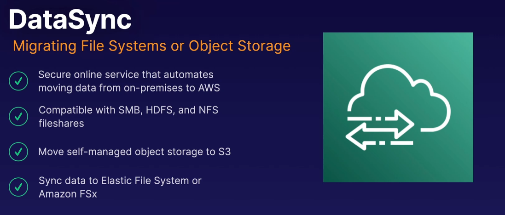
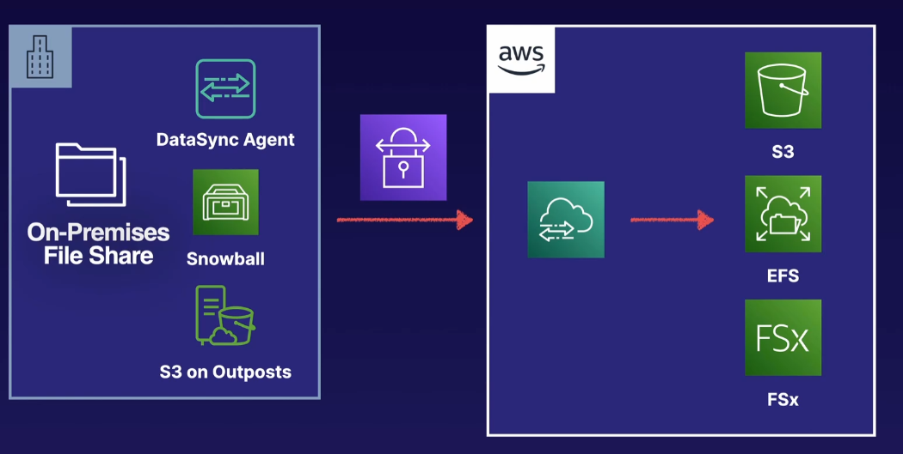
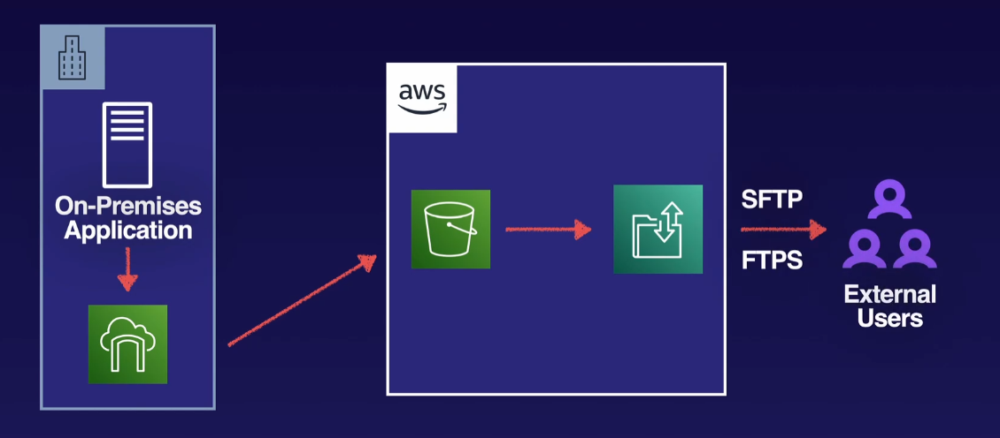
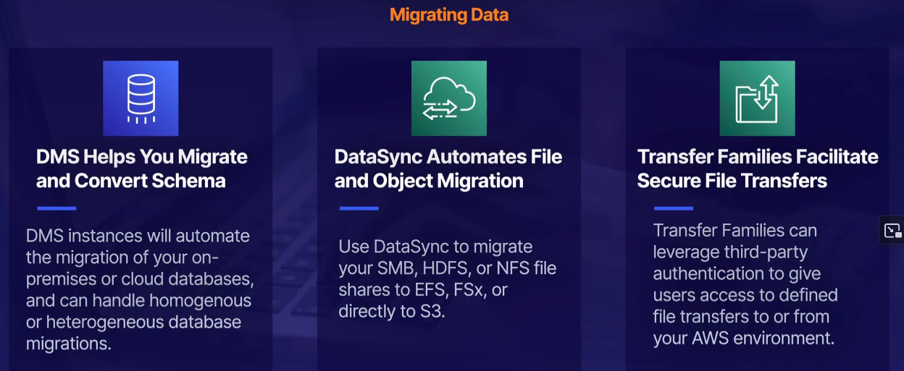

# Migrating Data

You need familiarity with AWS Storage Gateway and AWS Snowball.

## Database Migration Service

Heterogeneous Migration, that is migration from on type of source database to different type of target database.

## DataSync

## Transfer Family

### Up next [Network Migration](../network-migrations/README.md)...
