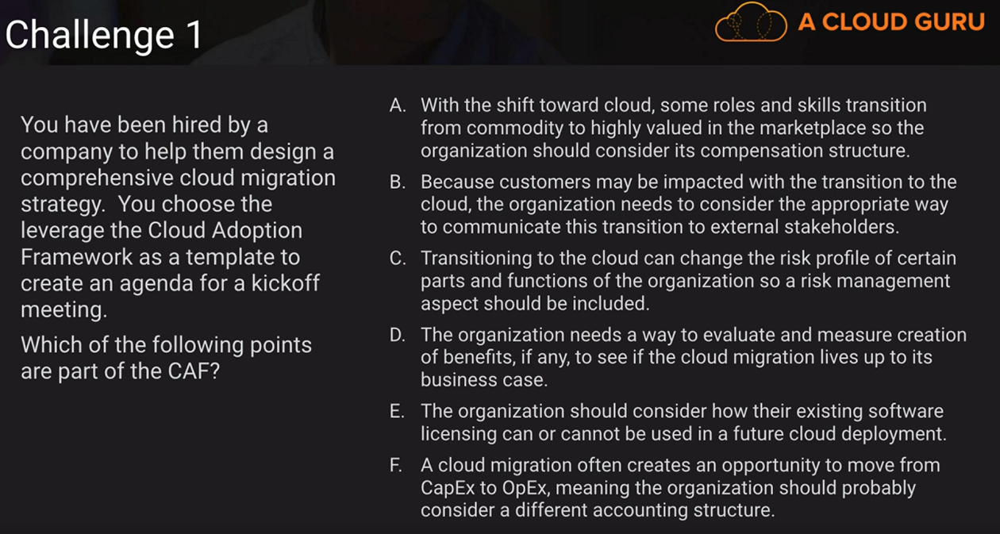
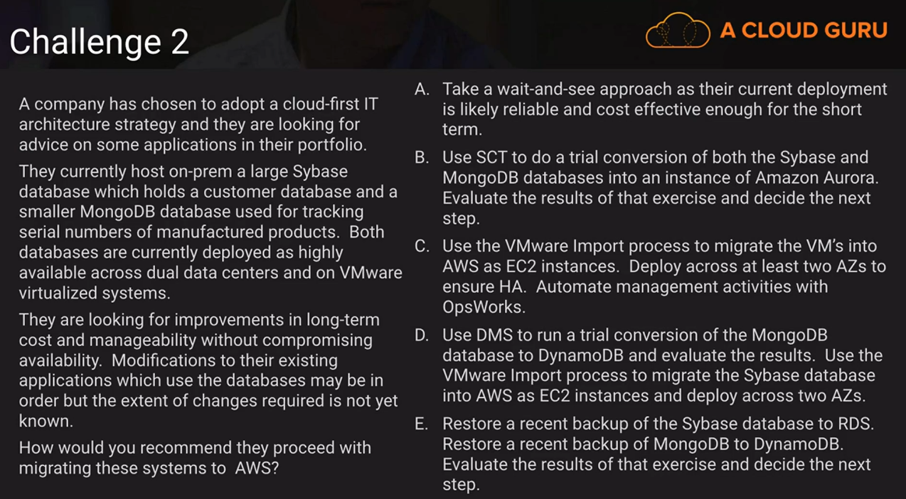

# Network Challenges

My answer: A, C

Answers:

A: Yes, its part of the people

B: Does not call out needs to communicate

C: Absolutely

D: You need to know how to measure the benefits

E: Yes, part of the framework. 

F: Not part of the Cloud Adoption

**Final answers: A,C, D, E**

My answer: D

Answers:

A: Long-term cost and maintainability

B: SCT does not support MongoDB - NoSQL. Only DMS supports NoSQL

C: Its true, its just lift and shift.

D: Its true, going to leverage DyanmoDB

E: RDS does not support Sybase

### [Architecture At Scale](../../architecture-at-scale/README.md)...

