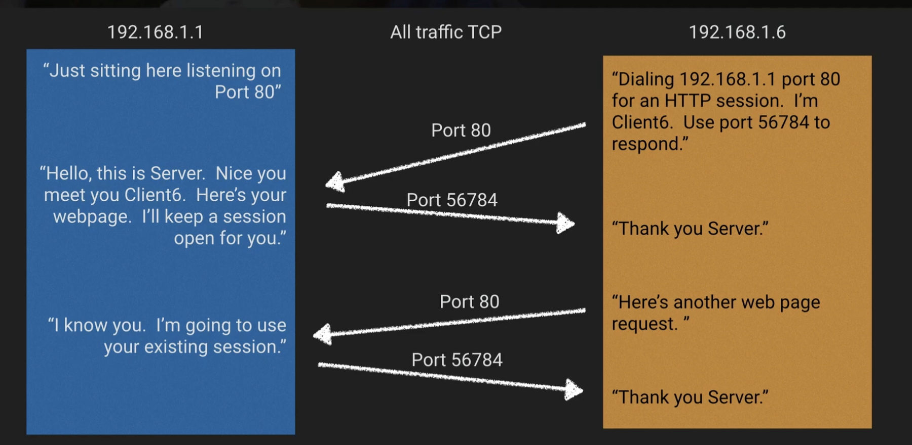

# Networking

Things we should already know:

- [ ]  Physical layout of AZs and Regions
- [ ]  VPC concept and how to create
- [ ]  Create private and public subnets
- [ ]  What a NAT is and what “Disable Source/Destination Checks” means
- [ ]  Route table and routing terminology (default routes, local routes)
- [ ]  IPv4 Addressing and Subnet Mask Notation (/16, /24, etc)
- [ ]  Intermediate Networking Terminology (Mac Address, port, gateway vs router)

## OSI Model

AWS Shared Responsibility Model (Layer 1 and Layer 2 is the responsibility of AWS). As well, AWS is a multi-tenante provider so they add restrictions.

## TCP vs UDP vs ICMP

## Ephemeral Ports

Short-lived transport protocols ports used in IP communications. They exist above the “well-know” IP ports (above 1024). They are at times called “Dynamic Ports”.
The suggested range for them is 49152 to 65535. However, different OS have different default, Linux kernels generally use 32568 to 61000.
Windows platforms default from 1025. They have some NACL and Security Group implications.

## Reserved IP Address

AWS uses certain IP addresses in each VPC as reserved. There are 5 IPs that are reserved in every subnet (example: `10.0.0.0/24`).

- `10.0.0.0` : Network Address
- `10.0.0.1`: Reserved by AWS for the VPC router
- `10.0.0.2` : Reserved by AWS for Amazon DNS
- `10.0.0.3`:  Reserved by AWS for future use
- `10.0.0.255`: VPCs don't support broadcast so AWS reserves this address

It is placement in the IP range that is reserved, not the actual number. If we look at a different CIDR block, example `192.168.8.16/28`

- `192.168.8.16` : Network Address
- `192.168.8.17` :  Reserved by AWS for the VPC router
- `192.168.8.18` : Reserved by AWS for Amazon DNS
- `192.168.8.19` : Reserved by AWS for future use
- `192.168.8.20` to `192.168.8.30`: Usable
- `192.168.8.31`: VPCs don't support broadcast so AWS reserves this address

## AWS Availability

Physical to logical assignments of an AZ is done at the account level. When your account get created, the physical availability zones are assigned to their logical names.

That means your US-WEST2A may be a different physical AZ than another account's US-WEST-2A.

### Up next [Amazon Managed VPC](./amazon-managed-vpn/README.md)...
