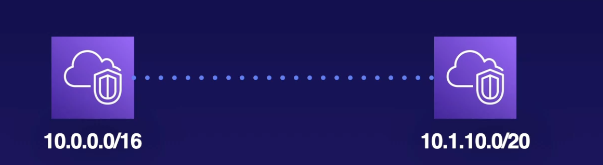
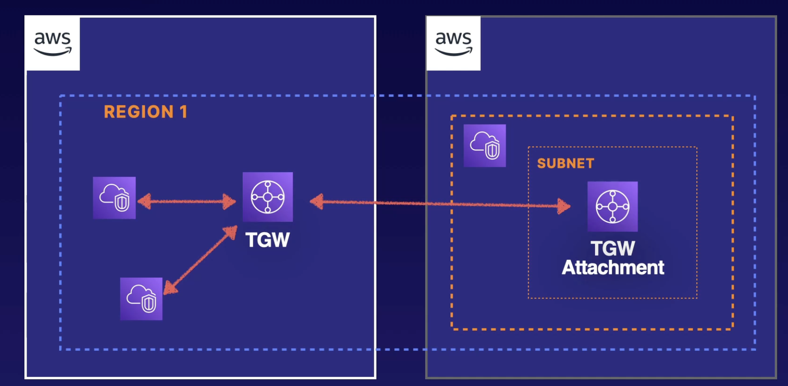
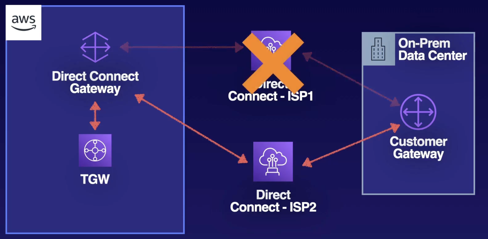

# AWS Direct Connect

## AWS Direct Connect PLus + VPC

It is more secure than regular Direct Connect as this one leverages IPsec.

## AWS VPN Cloudhub

## Software VPN

Could be leveraging for something like this: https://openvpn.net/quick-start-guide/

## Transit VPN

## VPC Peering

## Transit Gateway

Leverage a hub and spoke architecture

Transit gateway associate with subnets using transit gateway attachments. In order to communicate with all the subnets in your VPC, you’ll have to have a transit gateway attachment and at least one subnet per availability zone. Other subnets in that availability zone can communicate with the transit gateway by having a route to the transit gateway attachment that exists in the same availability zone.

In this diagram, we have a VPC with four subnets, and there are two subnets in availability zone 1 and two subnets in availability zone 2. Transit Gateway requires a transit gateway attachment in each availability zone in order to communicate with all four subnets. This transit gateway can be associated with other VPCs that have their own transit gateway attachments within their subnets.

## CIDR Consideration

The CIDR range of your VPC has two components. There is an IP address and a net mask, which defines the range of IP addresses available to that VPC and the subnets in it.

The IP address has four octets that we typically read in normal base 10 numbers.

Each octact can have the value from 0 to 255 for 256 total different values for each octet. The net mask on your CIDR block determines the number of IP addresses.

When calculating number of IP addresses for a subnet, subtract 5 for AWS reserved IPs.

In the following example, if we want to peer two VPCs, we have to make sure they do not collide.

## Example Diagrams of VPC-to-VPC Networking

Same account across different regions

Two different accounts in the same region

Hybrid environments

## Takeaways

## Routing Table

The most specific routes wins. Below is an example of a routing table.

1. The `10.0.0.0/16` that's your CIDR assigned to the VPC. That is your local route
2. The `192.168.0.0/24` that is going to a VPC or a VPC Gateway
3. The `0.0.0.0/0` is the default router to our NAT gateway
4. The `pl-xxxxxx` is the prefix list. This entry is set up to when you create an endpoint for your VPC. This could be a private link network, and it could be for an AWS service or it would be from a Marketplace Partner. This prefix list is a predefined mapping of all the IP addresses for that particular service. It acts like an intercept to route traffic that would normally go out through the default route (public internet) and it routes it through this VPC endpoint connection, which rides on the AWS network.

In this example, we see the routes on where they go depending on the routing table. Two notable entries are if an EC2 instance that is accessible via 192.168.0.7 makes a call to an S3 bucket, it will resolve the prefix list and end up resolving to vpce-xxxxx. Finally, the 10.0.255.255 is a trick question since VPCs do not support broadcast.

## Border Gateway Protocol

It propagates information about the network and allows for dynamic routing, meaning, I can choose different paths depending on the availability or the weight of a certain path. It is required for Direct Connect, but optional for VPNs. The alternative is using static routes. 

- AWS supports BCP community tagging as a way to control traffic scope and route preference
- Required TCP port 179 + ephemeral ports
- Uses Autonomous System Number (ASN), which uniquely identifies each endpoint in a BGP network.
- Weighting is local to the router and higher weight is preferred path for outbound traffic.

On the image above, we have two connections to AWS. One through the VPN and the other through the Direct Connect. If we want to cut over to Direct Connect, we can do that by giving it a high weight, like in the image below.

## Enhanced Networking

AWS offers enhanced networking for High Performance Computing. It uses single root I/O virtualization (SR-IOV) to deliver higher performance than traditional virtualization network interfaces. Drivers may need to be installed if used other than Amazon Linux HVM AMI.

- Intel 82599 VF Interface which tops of at 10 Gbps
- Elastic Network Adapter which tops of at 25 Gbps

## Placement Groups

It is the idea of having some control of our instances over the physical hardware that they live on.

## Hybrid and Cross-Account Networking.

The context of Hybrid is anytime you have on-premise data center, as well as presence in the AWS cloud.

**Direct Connect** allows you to create a private route from on-premise data center to the AWS cloud without traversing the public internet.

What if we want to connect to more VPCs? In the example above, we only have one.

You can provision a Direct Connect Gateway, which can connect to up to three virtual private gateways or transit gateways. You can also use a Public Virtual Interface to services with public endpoints such as S3 or DynamoDB

## Site-to-Site VPN

Fastest way to connect your on-premise network to the AWS cloud.

Below are a couple examples on how to set up site-to-site VPN

Alternatively, you can use the VPN Connection and connect to a Transit Gateway and communicate with transit gateway attachments across many VPCs within the same region.

The examples above either Direct Connect and VPC Connection require an Internet Service Provider which brings a Single Point of Failure. To mitigate, below are some examples that guarantee High Availability.

## High Availability

## Exam Tips

In the diagram below, we have On-Prem Data Center that is using two Direct Connect connections. On the AWS side, we have VPCs on multiple regions that we would like to connect to. Each Direct Connect connection is associated with the highly available Direct Connect gateway and they will be connected through private virtual interfaces. You will also be connected to those public services using a public virtual interface.  In order to associate your on-premise data center with all the VPCs across multiple regions, your Direct Connect gateway cam be associated with transit gateways in each region.

Those transit gateways will be associated with transit gateway attachments in each availability zone within each VPC. This way the On-Prem data center can connect to all the VPCs in all regions. For the VPCs to connect with each other, we will have to peer our two transit gateways, which will make it so the VPCs can communicate with each other.

In a similar example, the diagram below has two Direct Connect connections. And in this scenario we will need two Direct Connect gateways in our AWS environment. (A single Direct Connect gateway can support up to 3 transit gateways). In this case, we have four regions. And each Transit Gateway will be peered with each.

### Up next [Amazon Private Link](../private-link/README.md)...
