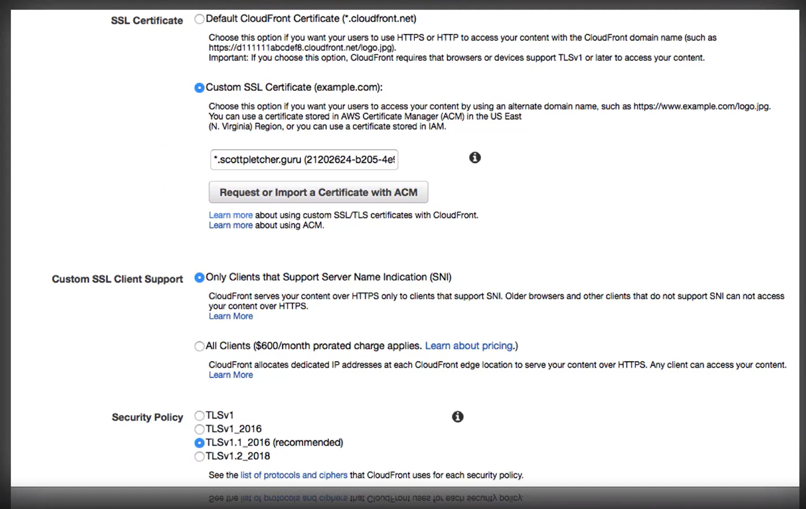
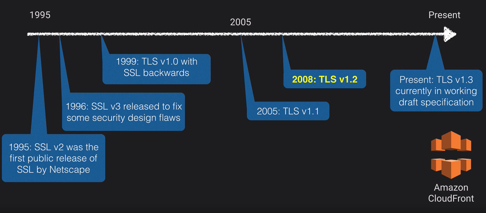
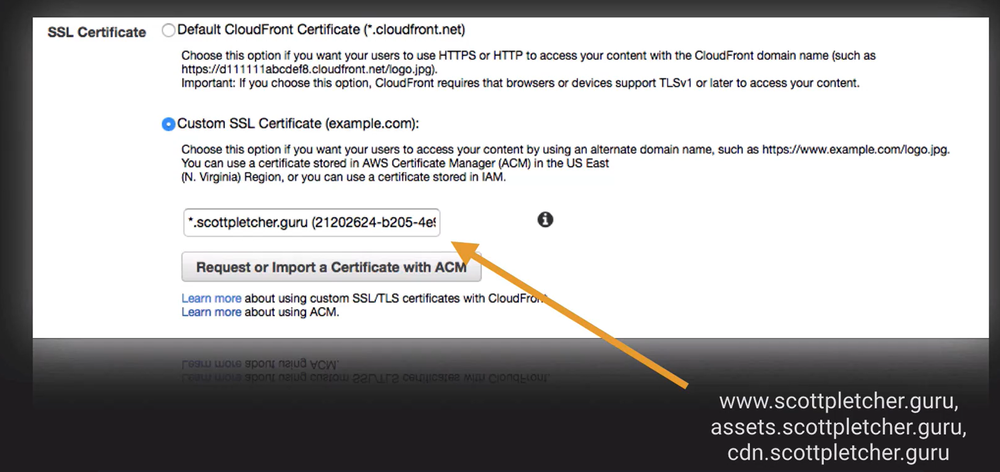
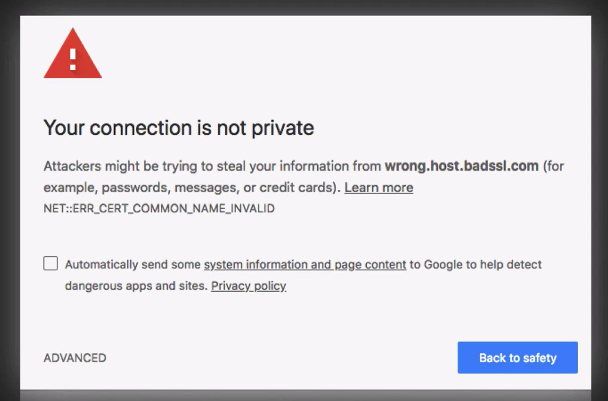
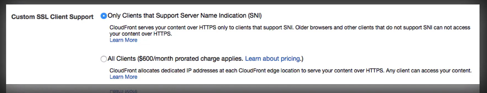
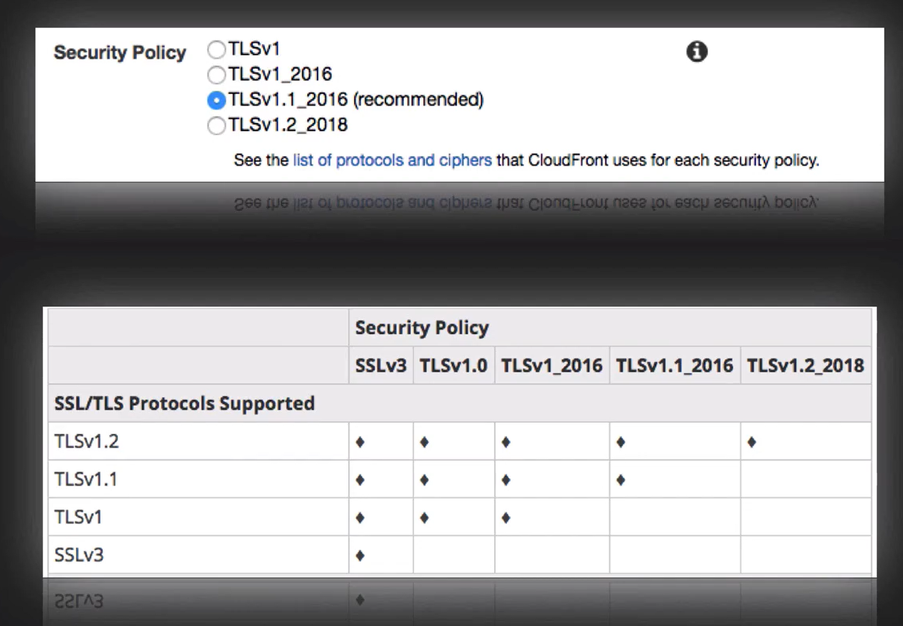

# Cloudfront

It is a distributed content delivery service for simple static asset caching up to 4k live and on-demand video streaming. You should already know how to create a CloudFront distribution and understand edge location concept. Integrated with Amazon Certificate Manager and supports SNI.

## SSL, TLS, SNI

You can generate a certificate using the AWS Certificate Manager or you can purchase your own. In the example below, the certificate is being created with a wildcard, `*`.

There is one issue with the above implementation. One of SSL’s main functions is to guarantee the website I am visiting is legitimate and it’s the correct website in the certificate. It does this by making sure the domain name of the server matches the certificate. 

Since CloudFront is a shared service, the host machine behind CloudFront will be serving up all sorts of content and all sorts of SSL certificates. To get around this issue, we have two options.

Using SNI = Server Name Indication, the client specifies which host is trying to connect to and the server can present multiple certificates on the same IP.

The security policy is also important on CloudFront as well. We can adjust what SSL and TLS versions our CloudFront distribution support by choosing a security policy.

### Up next [Elastic Load Balancer](../elastic-cloud-balancer/README.md)...
