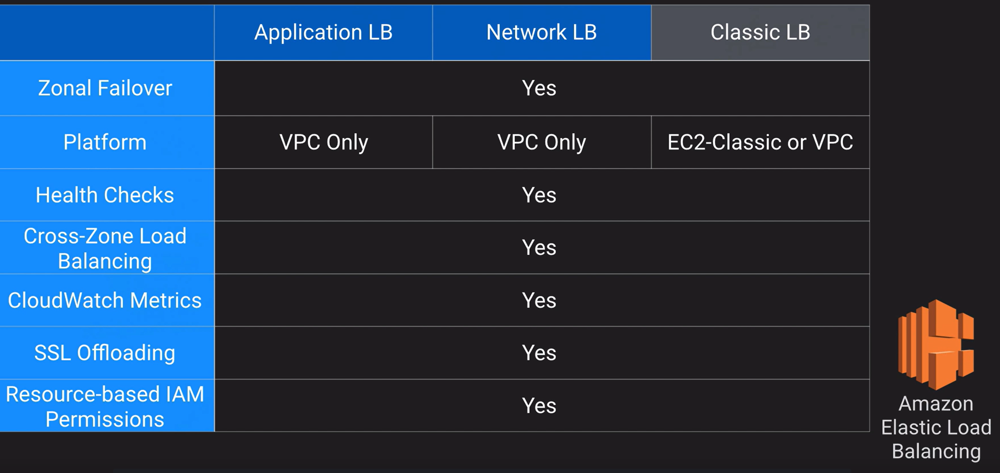
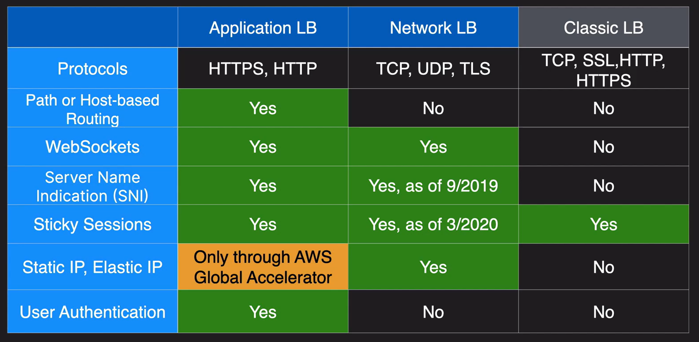
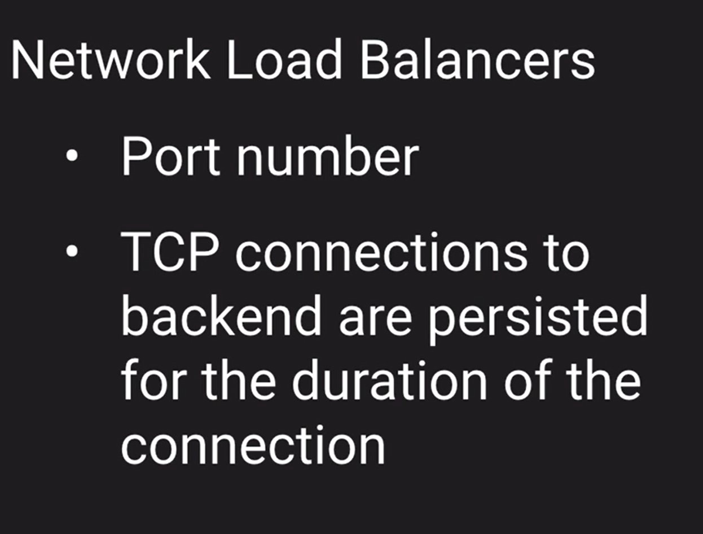
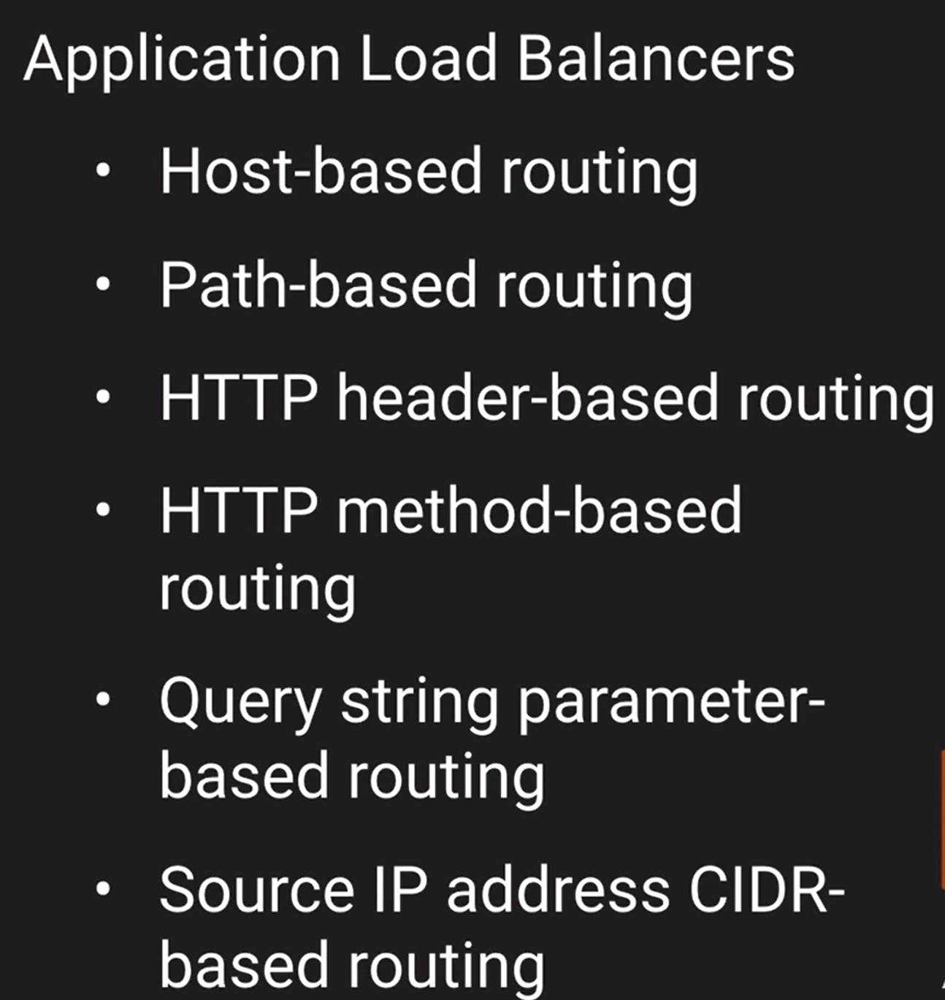
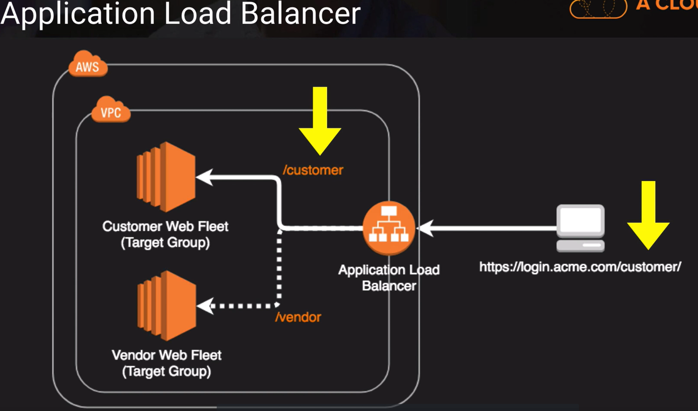
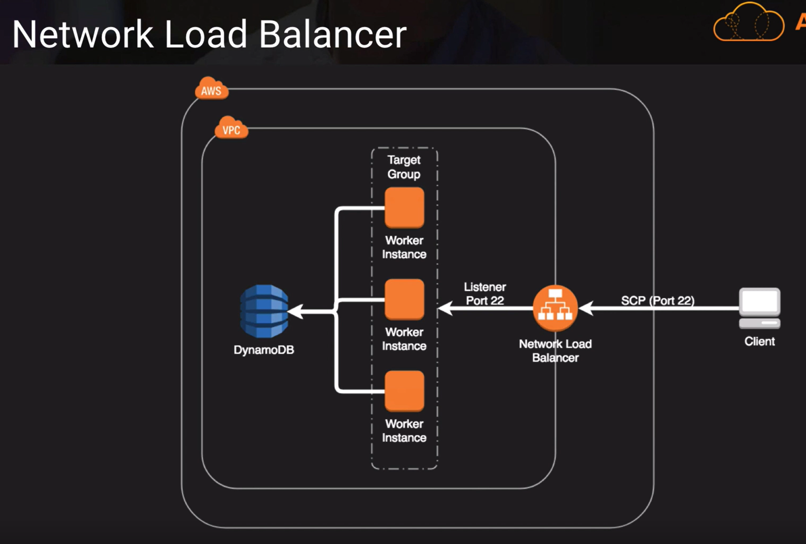

# Elastic Load Balancer

The number one function of load balancer is to distribute inbound to one or more back-end endpoints. AWS can three different options that you can use:

- Application Load Balancer (Layer 7)
- Network Load Balancer (Layer 4)
- Classic Load Balancer (Layer 4 or Layer 7)

It can be used for public or private workloads and it consume IP addresses within a VPC subnet. This load balancers are also auto-scaled hence the elastic part. As they scale they are going to consume IP addresses.

- All the Load Balancers have Zonal Failover. Meaning, if an AZ goes down, they are going to failover to another functioning AZ..
- Both the Application and Network Load Balancer now support TLS and SSL Termination.

In terms of routing, at Layer 4, where the Network Load Balancer is, we can route based on source port. For example, we can route traffic to instance 1 if that request comes in on port 81 or instance 2 if the request comes in on port 82.

For Application Load Balancers, which are on Layer 6, we have lots of options for routing.

Sticky Sessions

Most web application, keep up with clients using session IDs. This is a way to uniquely identify the client for stuff like shopping cart and session parameters. Enabling sticky session is how the ELB can keep track of the client and which web server it handed it off to.

### [Networking Pro Tips](../network-pro-tips/README.md)...