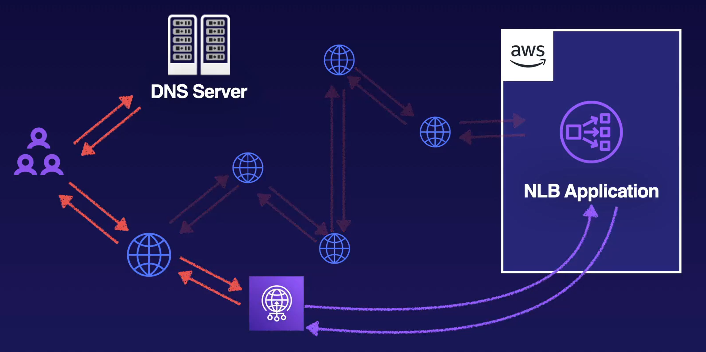
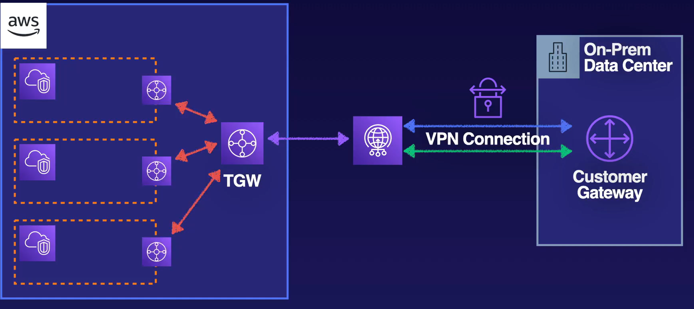
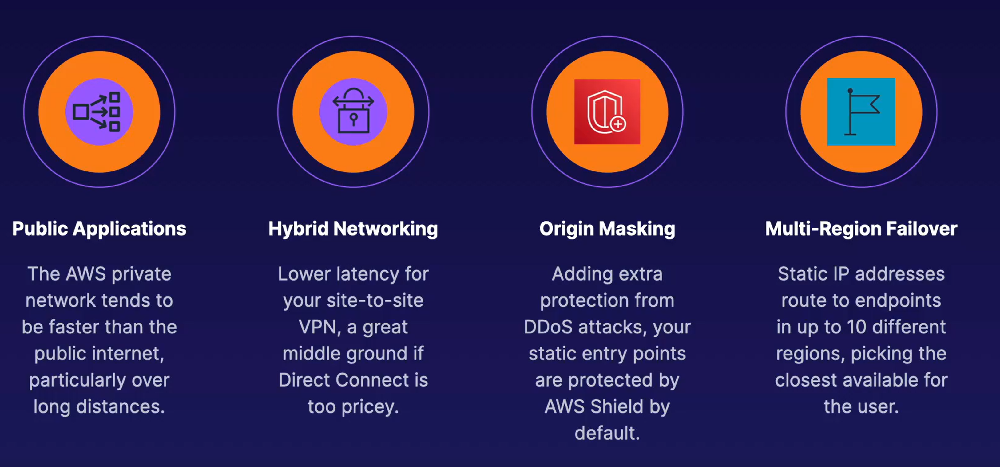
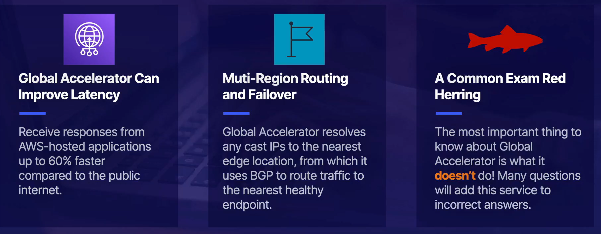

# Global Accelerator

It can be a distractor in the exam. Global Accelerator move AWS Endpoints Closer to your user.

- Allows public app users to short-cut past public infrastructure
- Hop on the AWS network at edge locations to reach your app faster
- Provides global static public IPs to access your application endpoint
- Improves networking performance, security, and reliability
- Can we used for failover in muli-region architecture

## How does it work?

In the diagram above, we have the red arrows which would follow a typical path from a user to the NLB Application. It first resolved in the DNS server and once it has an IP address, it can take several hops across the public internet. Global Accelerator provides a POP location closest to the user and leverages the Amazon Network or Backbone resulting in lower latency.

## Hybrid Networking

It can also be used in Hybrid Networking by creating a shorter path to and connecting to the Transit Gateway.

## Use Case

### Up next [Route 53](../route53/README.md)...

