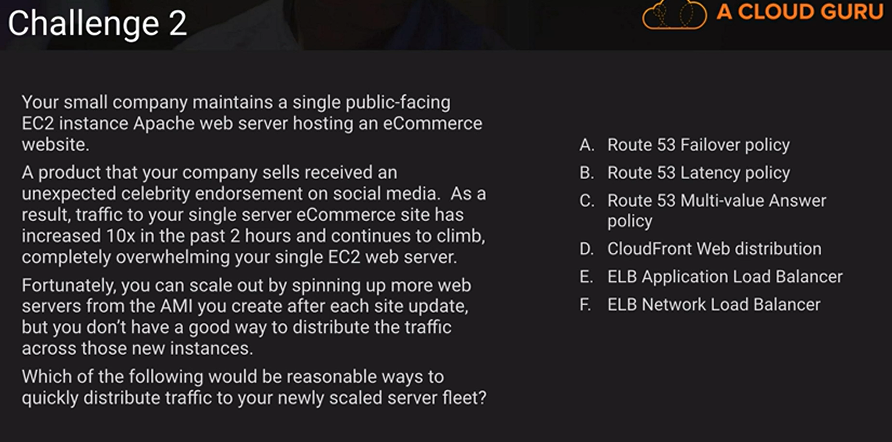

# Network Challenge

My answer: C / E / F

Result:

A: There is no such thing as advance peering mode 

B: It’s true that transitive peering isn’t supported natively by AWS, but that doesn’t explain slowness because if it wasn’t supported, they wouldn’t have any connectivity

**C: That is a perfect valid reason**

D: This is one of those all or nothing. If we didn’t have a route in the routing table in A, then we wouldn’t be able to reach D. 

E: Internet Gateways do not have any real bandwidth limit that we would hit, so it is not a reasonable answer.

F: If they are routing traffic all the way back to their corporate network, rather than routing through VPC peering,  the speed between the 2 VPCs would then be limited by the speed of their connection to each VPC back to their corporate network. And if they have undersized or maxed out internet connection, then the VPN connection speed would suffer as well. So this answer is a possibility

G: This is another all or nothing item. Account limits are enforced when you are trying to create a new thing. 

H: Some EC2 instances do  support Jumbo Frames, but the standard Ethernet MTU is 1500. And Jumbo Frame traffic going outside a VPC will be fragmented. And fragmentation will tend to slow down traffic. This is a plausible answer

Answers: C / H / F

My answer: E or B

Results

What is the real question being asked?

- Reasonable ways to quickly distribute traffic to your newly scaled server fleet.

What are the details that the questions provides that seem like they would help guide me?

- eCommerce
  - SSL Support
  - Cart Functionality
  - Sessions

A: It is not do be any good for distributing load across web servers.

B: It is not going to help me either because maybe all my users have the same latency and they are going to go to the same place. Which is not going to help me spread load over multiple servers.

C: We can use that to return multiple IP addresses for one DNS name, and it does have the effect of a load balancer, sort of a round robin type load balancer. Now, the client’s resolver may cache that IP address and just send it straight, and send it back to the same web server, what that’s really risky.

D: CloudFront isn’t an option for us all it does is serve up content, it is not going to spread load.

E: Application Load Balancer does support SSL and Sticky Session. We could create an ELB app load balancer, front it with a SSL certificate that we created in Amazon Certificate Manager and then add the new EC2 instance to the target group.

### Up next [Security](../../security/README.md)...

