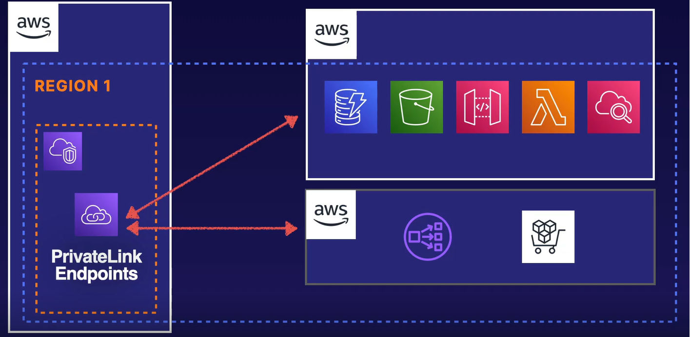
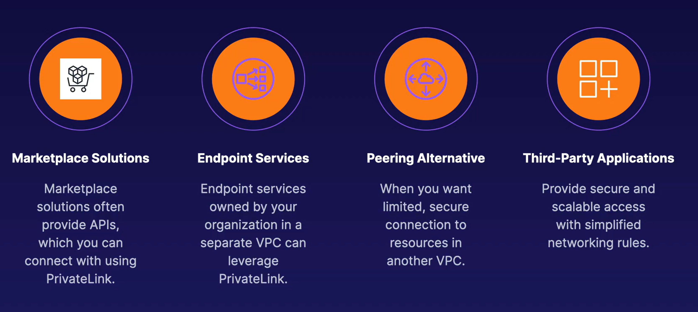
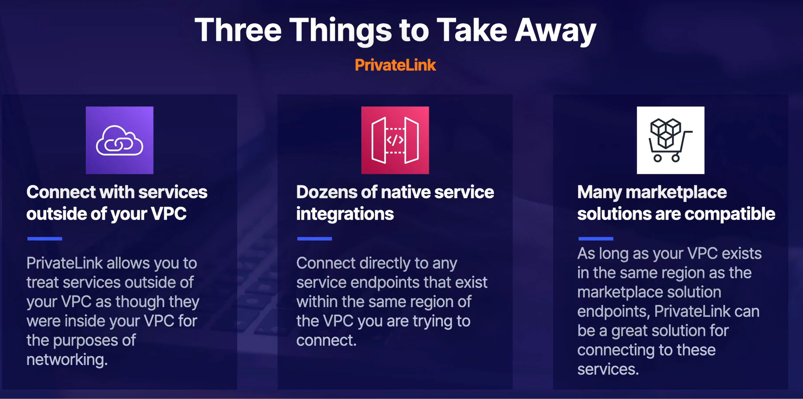

# Private Link

Secure way to secure your VPC to VPC endpoints. You can establish private connections to services outside of your VPC. Traffic does not traverse the public internet. It can connect to endpoints within the same region as your VPC.

There are several services that Private Link endpoint can connect with.  

The most common use cases for Private Link are the following:

### [Global Accelerator](../global-accelerator/README.md)...
