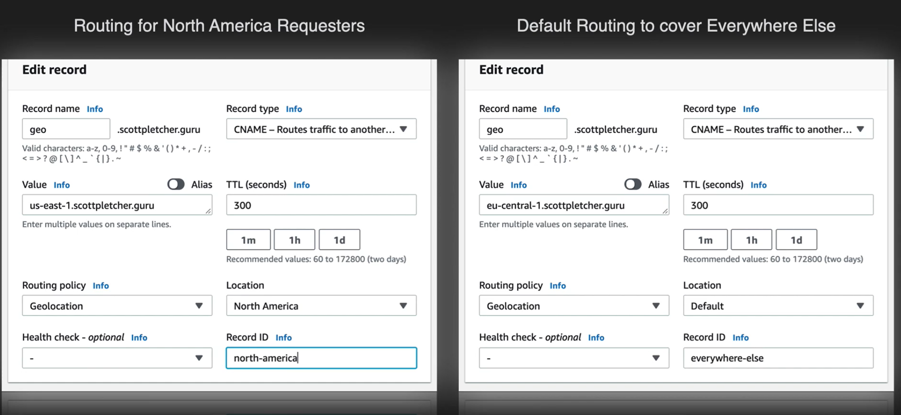
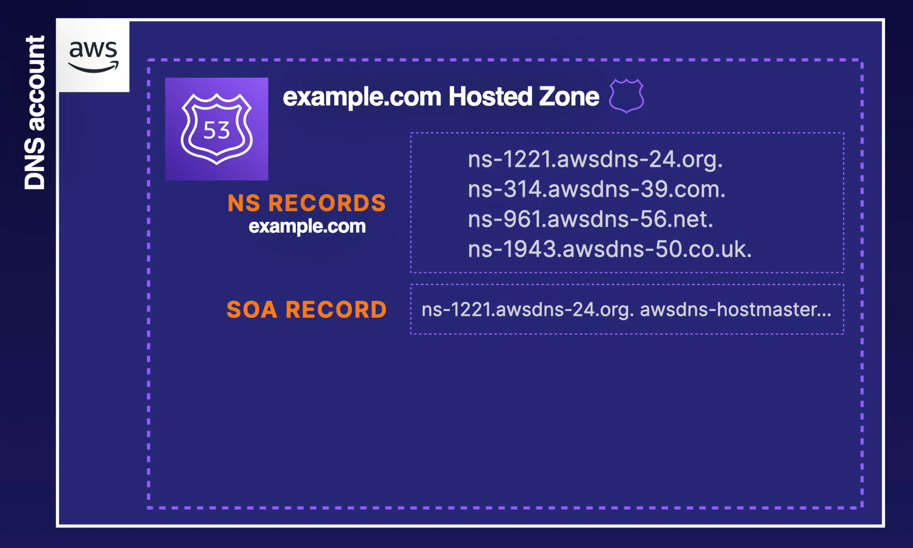

# Route 53

It is a service to register domain names, check the health of your domain resources and route internet traffic for your domain. It is called Route 53 because the DNS service port is 53.

Things you should already know

- [ ]  What is a DNS?
- [ ]  DNS record types (A, CNAME, MX, TXT, etc)
- [ ]  Route 53 Concepts (Alias, hosted zone, etc)

## Route 53 Routing Policies

## Simply Routing Policy

## Failover Routing Policy

## Geolocation Routing

## Geoproximity Routing

## Latency Routing

## Multivalue Answer Routing

## Weighted Routing

## Cross-Account Route 53

In order to achieve the above, where we want different sub domains for example.com in different accounts, we following the steps below.

1. Create a hosted zone in the account associated with your subdomain.
2. Copy the NS records from the newly created hosted zone

3. Access the parent DNS hosted zone in the appropriate account.
4. Crease a new NS record set in the parent domain’s hosted zone.
5. Paste the NS records from the child domain’s hosted zone.

Things to take into account

- A hosted zone is a collection of records
  - You can create a histed zone for each subdomain as long as you provide the appropriate NS records to the parent domain hosted zone
- Multiple Accounts help with Security and Visibility
  - Separating accounts by staging environments can allow you to fine-tune access and monitoring and then delegate control to the appropriate teams.

### Up next [Cloudfront](../cloudfront/README.md)...
