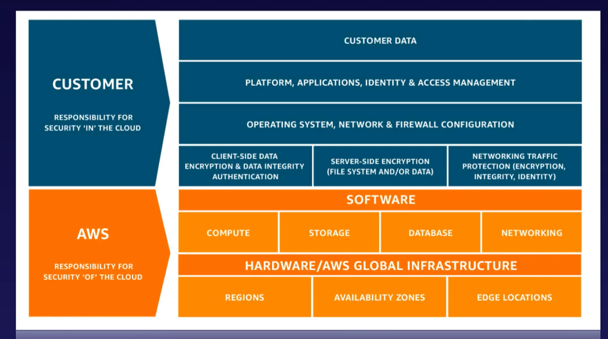
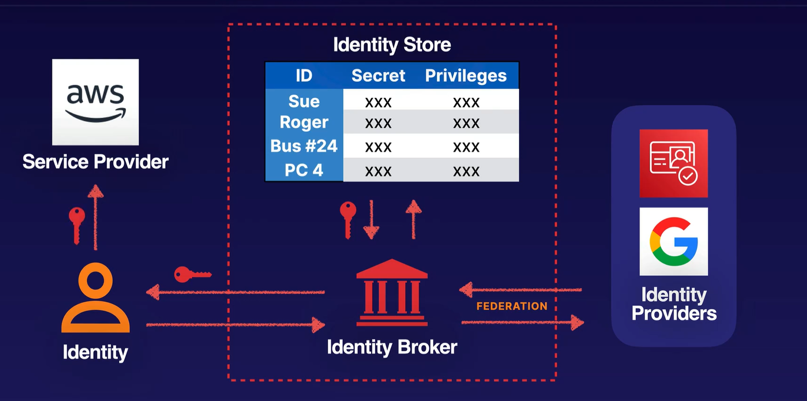
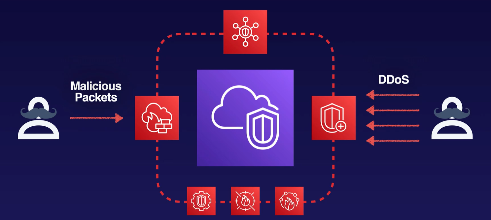

# Security

## Design Solutions for Organization Complexity

- Network Traffic monitoring
- AWS Identity and Access Management (IAM) and AWS Single Sign-On
- Encryption keys and certificate management (for example, AWS Key Management Service [AWS KMS], AWS Certificate Manager)
- AWS security, identity, and compliance tools (for example AWS CloudTrail, AWS Identity and Access Management Access Analyzer, AWS Security Hub, Amazon Inspector)
- AWS Resources sharing across environments

## Design for New Solutions

- IAM
- Encryption options for data at rest and data in transit
- Credential management services
- AWS managed security services (for example, AWS Shield, AWS WAF, Amazon GuardDuty, AWS Security Hub)

## Continuous Improvement for Existing Solutions

- Data retention, data sensitivity, and data regulatory requirements
- Secret management (for example, System Manager, AWS Secret Manager)
- Principle of least privilege access
- Security-specific AWS solutions
- Monitoring tool sets and services (for example, CloudWatch)

##  Accelerate Workload Migration and Modernization

- Governance Tools (for example, AWS Control Tower, Organization)

## Core Concepts of Cloud Security

Shared Responsability Model

The Principle of Least Privilege states that you should give users and services nothing more than those privileges necessary to perform their intended function…and only when they need them.

## Facets of Identity Security

**Identity** - Who are you? IAM user or role, root account users, temporary security credentials

**Authentication** - Prove you are who you say. Multi-factor authentication, client-side SSL certificate

**Authorization** - Are you allowed to do this? IAM policies

**Trust** - Do other entities I trust say they trust you? Cross-account access, SAML-based federation, web identity federation

Below is an example of Authentication and Authorization

## Network Security

### Planning for Things To Go Wrong

- Password will be stolen
- Expose resource will be access
- Static access keys will be leaked
- How can we limit the blast radius of security events?
- How do we prevent exposing sensitive data?

### Up next [AWS Organizations](./aws-organizations/README.md)...

