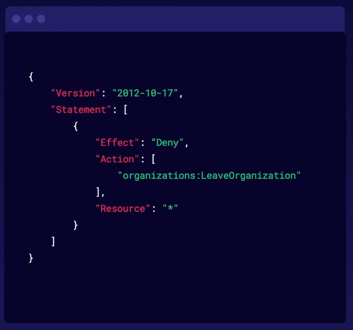
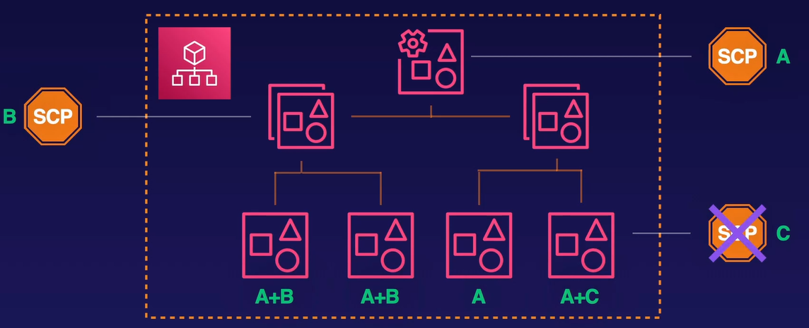
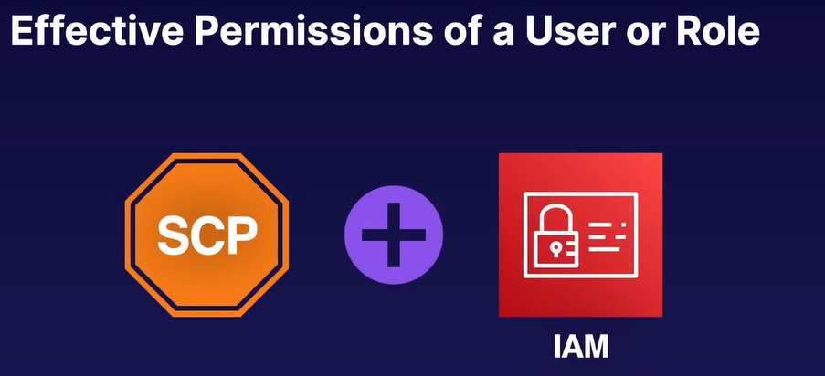

# AWS Config

## Controlling Access in Your Organization

Service Control Policy

- Can be applied to organization units, or accounts
- Uses IAM policy syntax, but never grant permissions
- Effects are inherited by all accounts below the SCP’s target

You can apply Service Control policies to the head of your organization. to organizational units or you can apply them to individual accounts.

It is best practice not to apply service policies to individual accounts. If you find your security needs are different for two accounts and a single OU, it’s likely you should consider breaking them into multiple OUs.

Service Control Policies come in two different flavours: Allow Lists and Deny Lists.

- A deny list explicitly denies specific actions for all affected user and roles
- An Allow list implicitly denies all actions not listed. Organizations are assigned two managed SCP FullAWSAccess by default.
- An action must be **allowed and not denied** in order for it to be available to users and roles in a given account.

An action is only enabled if allowed by an IAM policy and not denied by an SCP.

## AWS Config

Monitors best practices across your organization

- Define detective controls and view at glance whether accounts are compliant
- Discover noncompliant resources that require action
- Keep a history of actions that caused noncompliance

### [AWS IAM Identity Center](../aws-iam-identity-center/README.md)...