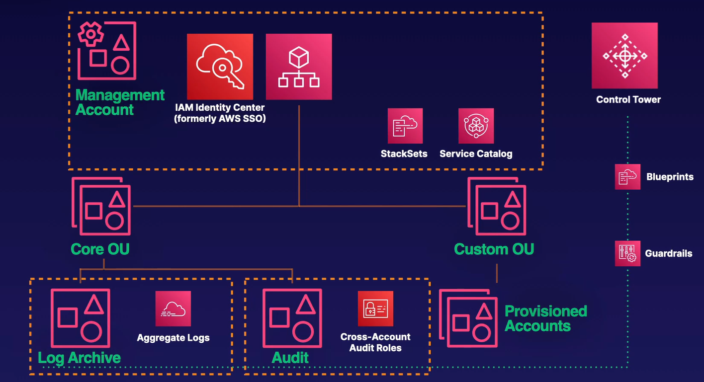
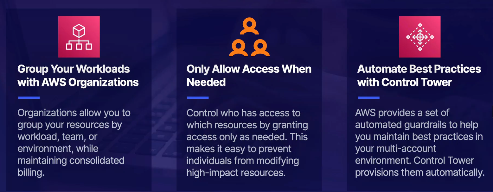

# AWS Control Tower

You can apply account-wide service control policies or AWS config rules all from a single point in your organization.

- Landing Zone
  - When you first start using Control Tower, you’ll create a landing zone and when you launch a new account using Control Tower, it will land in your landing zone. It will have all those recommended guardrails applied to it automatically, as well as permissions that Control Tower needs to provision the account.
- Guardrail
  - A high-level rule governed by service control policies or AWS Config rules
- Baseline
  - The combination of blueprints (CloudFormation stacks) and guardrails applied to a member account.

### Up next [AWS Config](../aws-config/README.md)...

